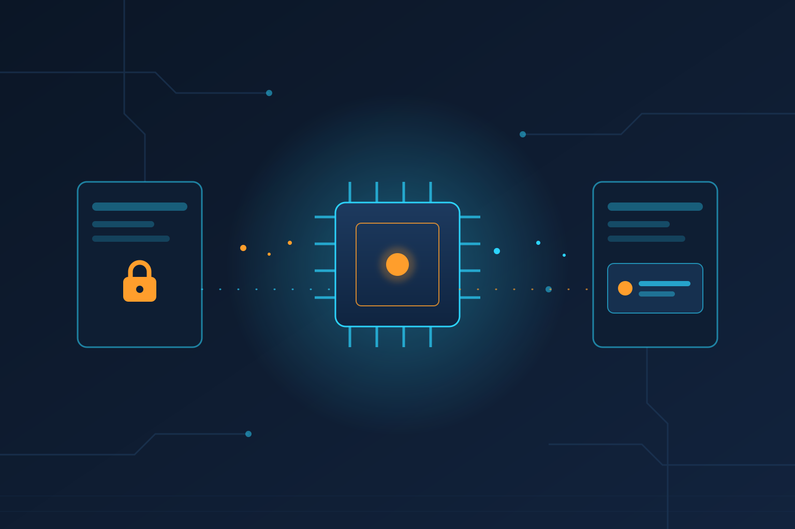

Spectre no murió con los parches de 2018, y Cloudflare lo acaba de demostrar con su propia infraestructura. En un post publicado ayer, el equipo de seguridad de Workers reveló que **re-evaluaron los ataques Spectre remotos contra su plataforma y lograron una fuga de datos confiable en producción: hasta 12 bits por segundo con 99% de precisión**, desde un Worker hacia otro Worker co-ubicado en el mismo proceso.

## ¿Qué encontraron exactamente?

Desde 2021 Cloudflare tiene una defensa en producción llamada **Dynamic Process Isolation (DyPrIs)**, que detecta scripts "maliciosos" y los aísla en procesos separados. Entre 2024 y 2025, el equipo construyó un proof-of-concept actualizado sobre el entorno productivo real y descubrió **una limitación en la implementación de DyPrIs** que permitía evadirla usando técnicas nuevas para estabilizar ataques Spectre: *Spectre gadgets*, temporizadores remotos y co-ubicación forzada entre tenants.

El detalle llamativo: la demo incluyó **filtrar un JWT desde un Worker vecino** a esa velocidad de 12 bits/s. Suena lento, pero un token de sesión cabe en unos pocos KB, y con paciencia (horas, no días) se exfiltra completo.

## La respuesta: tres capas nuevas

Como consecuencia de la investigación, Cloudflare endureció Workers con:
- **DyPrIs mejorado**, cerrando la vía de evasión encontrada.
- Integración del **V8 Sandbox** en el runtime.
- Un **mecanismo de aislamiento in-process** adicional que reduce el riesgo de divulgación de memoria entre tenants.

Importante: **no encontraron indicadores de explotación activa en los últimos tres años**, y el ataque ya está mitigado en producción. Los hallazgos están en un [paper en arXiv](https://arxiv.org/pdf/2608.17043) co-autorado con investigadores de TU Graz y la University of Nottingham.

## ¿Por qué importa?

Cloudflare Workers corre **decenas de miles de tenants en el mismo proceso OS** usando isolates de V8, porque es lo que permite cold starts casi nulos y densidad brutal en la edge. Esa apuesta arquitectónica siempre tuvo como asterisco "confiamos en aislamiento a nivel de lenguaje". Este tipo de investigación es exactamente lo que necesita el ecosistema: un vendor auditándose a sí mismo en producción, publicando el paper, y parcheando antes de que alguien lo explote afuera.

Para los que corren código multi-tenant en V8 (o planean hacerlo), el paper es lectura obligada. La lección de fondo sigue siendo la misma de siempre: aislamiento por proceso > aislamiento por lenguaje cuando el threat model incluye actores motivados.

**Fuentes:** [Cloudflare Blog](https://blog.cloudflare.com/revisiting-spectre-attacks-on-workers/), [The Hacker News](https://thehackernews.com/), [arXiv](https://arxiv.org/pdf/2608.17043)
