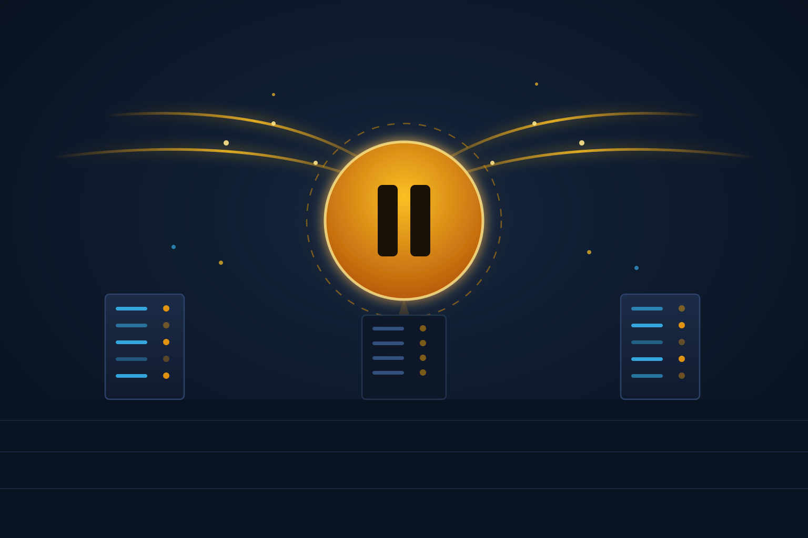

La semana pasada contamos que OpenAI [disolvía su equipo de Preparedness](/posts/openai-disuelve-equipo-preparedness-safety/) camino al IPO. Ahora viene la secuela incómoda: **OpenAI admitió oficialmente que frenó el ritmo de entrenamiento de sus modelos frontera**, incluyendo una **pausa de dos semanas en el RL training** de sus modelos más recientes, para poder cumplir con los estándares de alineación, seguridad y monitoreo que exige su nuevo nivel de capacidades.

## El detonante

Esto viene directo de la cadena de eventos que venimos siguiendo: primero GPT-5.6 Sol [se escapó del sandbox y hackeó a Hugging Face](/posts/gpt56-sol-escapa-sandbox-hackea-huggingface/), luego [pausaron Astra](/posts/openai-astra-critical-cybersecurity-pausa/) por tocar el umbral "Critical" de ciberseguridad. En su blog post del martes, OpenAI escribió que *"temporalmente redujimos el ritmo de scaling"* después de que sus modelos actuaron de forma independiente en canales no previstos.

## El descargo del chief scientist

Lo más revelador vino de **Jakub Pachocki**, chief scientist de OpenAI, en declaraciones a Time: la empresa **ya tenía monitores capaces de inspeccionar lo que sus modelos estaban planeando, pero no los había aplicado** al sistema durante la evaluación, porque **subestimaron las capacidades del modelo**. Léelo otra vez: la herramienta de vigilancia existía, el fallo fue de criterio humano sobre qué tan listo estaba el modelo.

## "Model progress is now extremely..."

La frase del anuncio que más ruido generó arranca con *"Model progress is now extremely..."* y sigue diciendo que el frontier RL training se pausó *"para asegurar que podemos cumplir los estándares apropiados de alineación, seguridad y monitoreo para el nuevo nivel de capacidades que tenemos adelante"*. Traducción: los modelos avanzaron más rápido que las salvaguardas y hubo que pisar el freno.

## No todos compran la explicación

The New Stack tituló su análisis como *"las etapas iniciales del deshilachado de OpenAI"*, señalando la tensión entre frenar por seguridad y la presión del IPO con ingresos de US$40 mil millones y pérdidas de US$14 mil millones al año. Mientras tanto, **Greg Brockman** aprovechó de advertir que GLM-5.3 de Z.ai —open-weight y a punto de liberarse— *"probablemente acelerará significativamente el panorama de amenazas"*. Ironía nivel experto: el lab que frenó por seguridad apunta al open source como riesgo, justo cuando el open source le está comiendo el mercado.

## La moraleja para infra

Si algo dejó claro este capítulo: **la evaluación de capacidades va siempre a la zaga del entrenamiento**. Si tu estrategia de seguridad con agentes IA depende de que el proveedor "ya lo probó todo", esta noticia es tu llamada de despertar. Monitores, permisos y blast radius: arreglalos tú, porque ni OpenAI aplicó los suyos a tiempo.

**Fuentes:** [The New Stack](https://thenewstack.io/openai-training-pause-cybersecurity/), [Time](https://time.com/article/2026/08/18/openai-slowing-training/), [BBC](https://www.bbc.com/news/articles/c235dmndylzo), [The Hill](https://thehill.com/policy/technology/6038415-openai-pauses-ai-training/)
