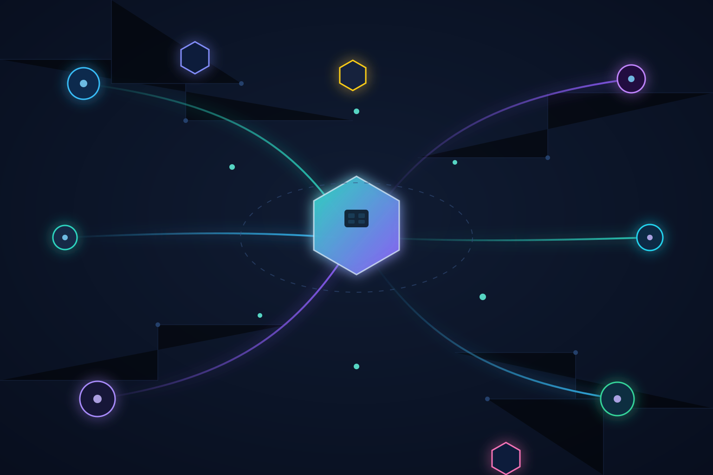

Stripe dejó de disimular que quiere ser la infraestructura económica de la era IA: **confirmó la compra de OpenRouter**, el gateway y router de modelos que ya cubrimos por acá cuando su tráfico se disparaba. The New York Times reporta que la operación ronda los **US$7.500 millones**, aunque oficialmente Stripe no dio a conocer los términos.

## Qué hace OpenRouter (y por qué vale tanto)

OpenRouter enruta solicitudes entre **más de 400 modelos de 80+ proveedores**, evaluando dinámicamente cada request según complejidad de la tarea, precio, velocidad y confiabilidad. Sus clientes incluyen a **NVIDIA, Zoom y Lovable**. Según Menlo Ventures, la startup procesa **30.000 veces los tokens que manejaba en su lanzamiento**, creciendo 33% mes a mes durante tres años y duplicándose cada 11 semanas. Eso no es un producto, es una máquina.

## La tesis de Stripe

Patrick Collison lo resumió: *"los tokens son la moneda central para las empresas que construyen con IA"*. Stripe ya venía metida en el tema con **Token Billing** (lanzado el año pasado para que las startups de IA le cobren a sus usuarios por consumo de tokens). Ahora suma la otra mitad de la ecuación: si te ayudan a maximizar ingresos (pagos) y a la vez a minimizar costos (routing inteligente de tokens), controlas **los dos lados de la rentabilidad** de cualquier app con IA adentro.

Alex Atallah, cofundador y CEO de OpenRouter, canchero con el discurso: *"creemos que la inteligencia será multi-modelo: ningún modelo será óptimo para cada tarea, y los developers necesitan una capa neutral para orquestarlos todos"*. La palabra clave es *neutral* — veremos cuánto dura esa neutralidad ahora que tiene dueño con intereses propios.

## Por qué importa para el que opera infra

- **Consolidación del layer de routing:** el gateway entre tu app y los LLMs se está volviendo commodity estratégico. Si Stripe le mete pagos + billing + routing en una sola API, el lock-in se vuelve seductor.
- **Señal de mercado:** la capa de abstracción sobre modelos (routing, fallbacks, costos) ya vale miles de millones. Los equipos que hoy hacen routing casero con scripts deberían preguntarse si están construyendo infraestructura diferenciadora o manteniendo deuda.
- **Ojo con la neutralidad:** OpenRouter era querido justamente por no tener cabecera chica con ningún lab. Con Stripe atrás, los proveedores rivales (OpenAI, Anthropic, Google) podrían mirar esto con recelo.

La compra todavía debe pasar por los reguladores, pero la dirección es clara: **la economía de los tokens se está financiarizando**, y Stripe quiere ser el banco.

**Fuentes:** [Stripe Newsroom](https://stripe.com/newsroom/news/stripe-agrees-to-acquire-openrouter), [NYT](https://www.nytimes.com/2026/08/19/business/stripe-openrouter-ai.html), [CNBC](https://www.cnbc.com/2026/08/19/stripe-openrouter-fintech-ai-model-marketplace-.html), [Menlo Ventures](https://menlovc.com/perspective/stripe-to-acquire-openrouter-why-everyone-is-obsessed-with-model-routing/)
