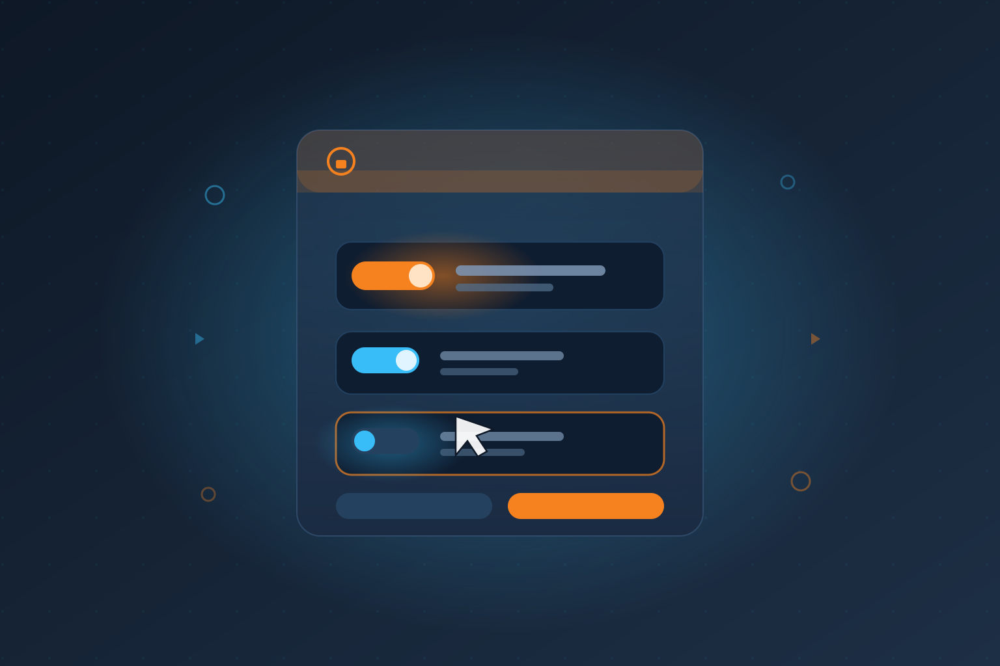

La pantalla de consentimiento de OAuth siempre ha sido una especie de extorsión con pasos de más: la app pide diez permisos, y tú solo quieres que lea tu calendario. Opción A: aceptar todo. Opción B: negarte y no usar la app. Cloudflare se cansó de ese binario tonto y anunció **scope customization para OAuth**: los desarrolladores pueden marcar scopes específicos como opcionales, y los usuarios pueden desmarcarlos directamente en la pantalla de autorización.

## El contexto

Desde junio, los desarrolladores han creado miles de apps OAuth de terceros sobre Cloudflare, con **más de un millón de autorizaciones** desde entonces. El modelo de permisos se ha vuelto más granular con el tiempo — SaaS, herramientas internas, CLIs y agentes — y esa granularidad choca frontalmente con una pantalla de consentimiento que era, en la práctica, all-or-nothing para el usuario final.

## Cómo funciona

- El dueño del cliente OAuth marca scopes como **required u optional** en la configuración
- En el momento de autorizar, el usuario puede **deseleccionar los scopes opcionales** del set solicitado
- El servidor de autorización entrega el subconjunto aprobado — algo que el estándar OAuth ya permitía (una authorization server puede otorgar menos scopes de los pedidos), y Cloudflare construyó encima de esa flexibilidad para que funcione limpio con todas las apps existentes

## Por qué esto importa justo ahora: MCP y agentes

El ejemplo perfecto que da el propio Cloudflare son los **servidores MCP**. Un MCP server típicamente pide un set amplio de permisos porque, en teoría, un agente podría usarlos todos. En la práctica, la mayoría de los usuarios no quiere regalarle ese nivel de acceso a un agente autónomo. Antes de esta feature, la única salida era que el desarrollador construyera una pantalla custom de selección de scopes antes de mandar al usuario al flujo de consentimiento. Ahora eso viene incluido.

Con agentes de IA actuando en nombre de usuarios — y con el ecosistema MCP explotando — el principio de menor privilegio dejó de ser un nice-to-have. Que el usuario pueda recortar el acceso en el mismo momento de autorización es un cambio de calidad, no de cantidad.

## Mi lectura

Es una de esas mejoras que parecen pequeñas y no lo son: mueven el punto de control desde "confía ciegamente en el desarrollador" hacia "el usuario decide el alcance real". Para cualquiera construyendo integraciones OAuth — especialmente agentes que actúan con credenciales de terceros — esto reduce fricción y riesgo al mismo tiempo. Raro que tarde tanto en ser estándar, la verdad.

## Enlaces

- [Cloudflare Blog — From all-or-nothing to task-based OAuth consent](https://blog.cloudflare.com/task-based-oauth-consent/)
