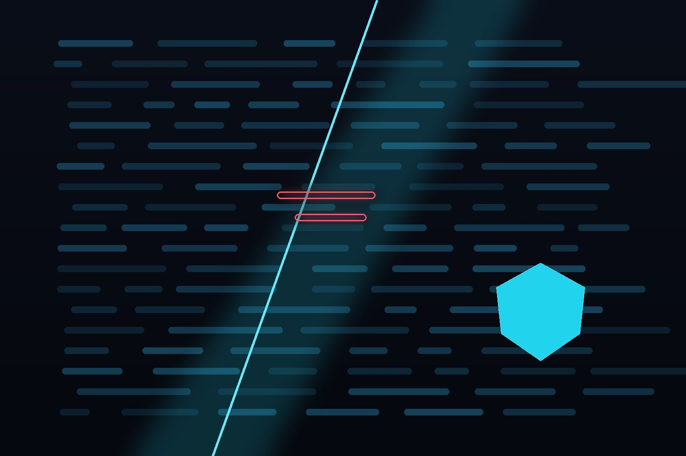

Aikido Security acaba de publicar uno de esos benchmarks que uno sí puede tomar en serio: quemaron **11.700 millones de tokens** poniendo 10 modelos de IA a redis-cover 32 vulnerabilidades reales recién divulgadas (CVEs frescos, sin contaminación de entrenamiento), con tres corridas por modelo y 96 runs totales. El resultado es una bofetada para el establishment cerrado: **el open source ya juega en primera línea en seguridad ofensiva de código**.

## Los hallazgos clave

- **DeepSeek V4 Pro 0813 encontró más vulnerabilidades que nadie**: 28 de 32 al sumar tres corridas.
- **No necesitas el modelo más caro**: tres corridas de DeepSeek Pro cuestan ~US$295 y superan a Claude Opus 5, Grok 4.6 y GPT-5.6 Sol. Tres corridas del Flash cuestan US$108 y alcanzan 24 hallazgos — igualando la mejor pasada individual de Grok por un cuarto del precio.
- **La consistencia es el truco**: una sola corrida de DeepSeek Pro encuentra 17; al repetir y combinar, llega a 28. Los modelos son inconsistentes en recall, y la repetición lo remedia. Lección práctica para pipelines de seguridad: **corre varias veces y une resultados**.
- **GLM-5.3, Qwen y Kimi K3 también son frontier-tier** en esta categoría, con hallazgos consistentes sin sacrificar cobertura.
- **El costo de lo barato es el ruido**: los modelos open produjeron más falsos positivos, que el pipeline tiene que filtrar.

## Por qué importa

Esto confirma una tendencia que veníamos viendo: la brecha entre modelos abiertos chinos (DeepSeek, Qwen, GLM) y los cerrados occidentales en tareas técnicas concretas ya se cerró — y en price-performance, se invirtió. Para equipos de AppSec y devops con presupuesto, la conclusión es directa: un ensemble barato de modelos open corriendo en paralelo le gana a una suscripción premium a un modelo cerrado.

La letra chica: es un benchmark de un vendor (Aikido usa estos modelos en su propio producto de AI Code Analysis), así que hay incentivo comercial. Pero la metodología — CVEs frescos, múltiples corridas, costos publicados — es de las más serias que he visto.

**Fuentes:** [Aikido Security](https://www.aikido.dev/blog/ai-model-benchmarks-aug-21-2026)
