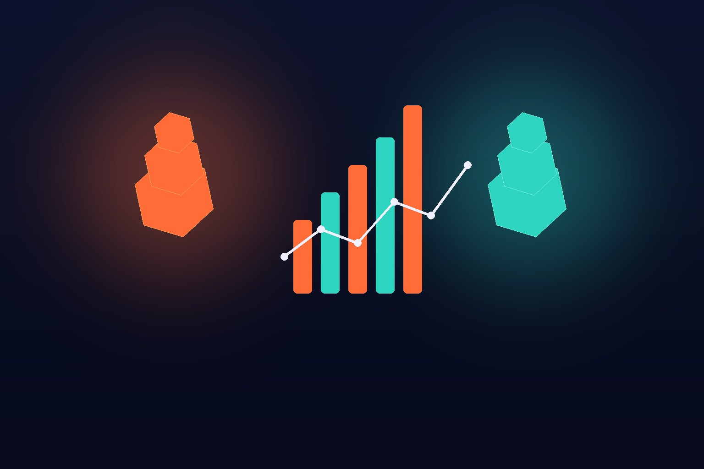

La guerra enterprise entre OpenAI y Anthropic tiene un nuevo capítulo, y esta vez con data dura de por medio: Ramp, la fintech de tarjetas corporativas y gestión de gastos, publicó números de gasto en IA de más de 70 mil empresas estadounidenses — y la lectura es que **OpenAI está creciendo más rápido que Anthropic en lo que va del Q3**.

## Los números

Contexto rápido: Anthropic le arretró el liderazgo a OpenAI entre los clientes business de Ramp en mayo de este año (41% vs 39%). Desde ahí no lo había soltado. A julio, Anthropic iba cerca del 44% contra casi 40% de OpenAI.

Pero según el economista de Ramp, Ara Kharazian, la tendencia intra-Q3 muestra a OpenAI acelerando. Ojo: queda un mes de trimestre, que en años-AI es como una década, así que nada está escrito.

## ¿Por qué está pasando?

Kharazian lo atribuye en parte a que **GPT-5.6 Sol se ha convertido en la elección creciente de developers**, mientras que **Fable 5 de Anthropic decepcionó en adopción** por su precio y por los requisitos de retención de datos que le impusieron los reguladores — sí, esos mismos 30 días de logs que le contamos hace dos días y que OpenAI aprovechó para mostrar su sistema zero-retention.

## Lo interesante de fondo

- **El gasto enterprise en IA es volátil**: las empresas saltan de lab en lab con cada release. Eso debería preocupar a los inversionistas de ambas casas de cara a sus IPOs — el "stickiness" del gasto corporativo en IA está por demostrarse.
- **El mercado total sigue creciendo**: la proporción de empresas que pagan por IA pasó del 50% en marzo a casi 56% en julio. La pelea es por el share de un pastel que agranda.
- **La data tiene sesgo**: clientes de Ramp skew tech/Silicon Valley, y excluye enterprises grandes que usan Amex. Es un indicador, no un censo.

**Mi toma:** la jugada de privacidad de OpenAI de esta semana no fue casualidad — fue munición para exactamente esta batalla. Anthropic ganó el relato developer en la primera mitad del año, pero precio + compliance le están pasando la cuenta. El mes que viene va a estar entretenido.

**Fuentes:** [TechCrunch](https://techcrunch.com/2026/08/20/openai-is-gaining-on-anthropic-with-business-users-new-data-indicates/), [X/Ara Kharazian](https://x.com/arakharazian/status/2090467448793313727)
