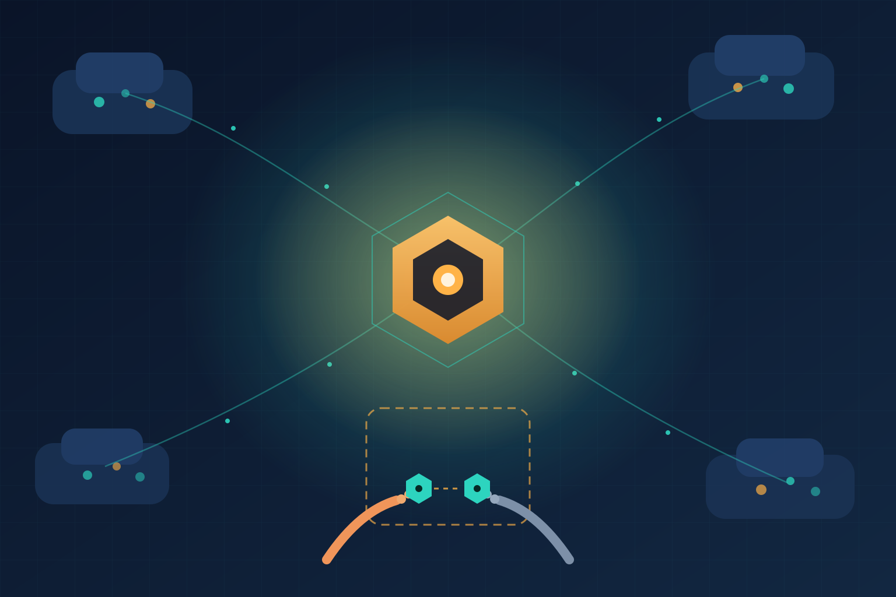

Si tu vida es administrar plataformas, ya conoces el calvario: control planes de Kubernetes regados por tres clouds, on-prem y edge, cada uno con su propia vista de estado, sus credenciales y su lógica de gobernanza. Upbound —la empresa detrás de **Crossplane**, el framework graduado en la CNCF con más de 100 millones de descargas y 1.000+ organizaciones usándolo en producción— acaba de lanzar **Upbound V3**, una apuesta directa a resolver exactamente eso.

## Lo nuevo de V3

- **Hub**: una capa de API unificada que indexa recursos a través de todos los control planes conectados. Una sola superficie para consultar y actuar sobre el estado completo del fleet.
- **Console**: una interfaz web única para los operadores humanos, en vez del tour de dashboards por proveedor.
- **Upbound Insights**: visibilidad en vivo de toda la flota de infraestructura.
- **Cross-region disaster recovery**: y ojo con el dato, porque según el benchmark de Kubernetes Operations de ECI Research/Nutanix, solo el **18%** de los equipos está "completamente confiado" (probado y verificado regularmente) en su capacidad de recuperar un despliegue multi-cluster tras una falla regional catastrófica. Es decir, el 82% restante está más o menos cruzando los dedos.
- **Air-gapped deployments y supply chain segura**: imágenes firmadas SLSA Level 2 y resúmenes CVE por versión.

## La parte que de verdad importa: agentes con RBAC de primera clase

Acá está el giro interesante, y no es cosmético. V3 extiende el mismo modelo de identidad, acceso y gobernanza a los **agentes de IA que operan infraestructura junto a ingenieros humanos**. Traducción: un agente pasa a ser un principal más del sistema, sujeto a las mismas políticas RBAC, al mismo scoping de credenciales y al mismo audit trail que una persona.

Y esto es más difícil de lo que suena. Los humanos navegan ambigüedad: leen documentación, preguntan, usan criterio. Los agentes no: necesitan que el estado, los permisos y la gobernanza estén disponibles programáticamente y de forma consistente, o fallan de maneras impredecibles. La arquitectura de Crossplane juega a favor acá: como cada recurso es un objeto Kubernetes con spec y status conocidos, un agente puede consultar, razonar y actuar sobre la infraestructura por la misma API que usaría una persona. Sin middleware artesanal traduciendo entre capacidades del agente y APIs de cada cloud — que al final solo reintroduce la fragmentación en otra capa.

## El contexto de toil que motiva todo esto

El mismo estudio de ECI Research trae otro número incómodo: **55,9%** de los encuestados dice que entre 11% y 25% del tiempo de sus equipos de Platform Engineering/DevOps se va en toil operativo, tareas manuales repetitivas de poco valor estratégico. No es un problema de staffing; es estructural. Upbound apunta a cerrarlo a nivel de arquitectura, no con otro dashboard pegado con escOTel encima del desorden.

## Mi lectura

La posición competitiva de Upbound es distinta a la de los hiperscalers: construida sobre Crossplane, es estructuralmente neutral. La apuesta es que la fragmentación se volvió lo suficientemente dolorosa como para justificar una capa de unificación dedicada — y que el próximo habitante de esa capa no va a ser solo otro SRE, sino un agente de IA que necesita los mismos rieles que cualquiera. Si estás armando plataforma interna o integrando agentes en CI/CD, este anuncio vale una lectura detenida.

## Enlaces

- [Análisis completo — Efficiently Connected](https://www.efficientlyconnected.com/upbound-v3-unified-infrastructure-governance-ai-agents/)
