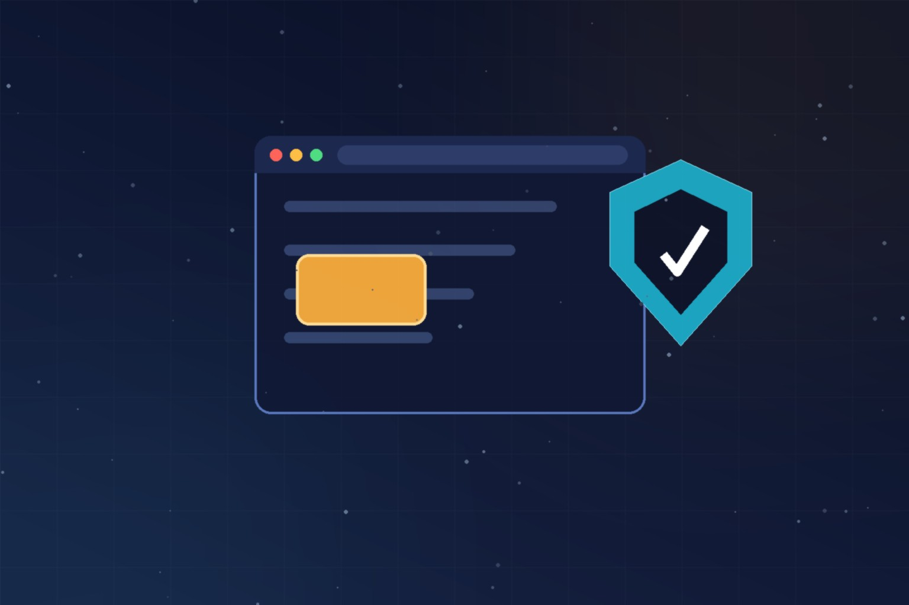

Google liberó **Chrome 151 Stable** con **siete vulnerabilidades corregidas**, y la estrella del lamentable show es **CVE-2026-76017**: un *use-after-free* de severidad **crítica** en **Chromoting**, el componente que da vida a Chrome Remote Desktop. Según la descripción del CVE, un atacante remoto podía **ejecutar código arbitrario fuera del sandbox mediante tráfico de red manipulado**. Sí: fuera del sandbox. La palabra que nadie quiere leer en un advisory de navegador.

## Lo esencial

- **Versiones parcheadas:** 151.0.7922.173/.174 en Windows y macOS, 151.0.7922.173 en Linux.
- **El flaw crítico:** use-after-free en Chromoting, reportado internamente por Google el 11 de junio de 2026. "Internamente" importa: lo cazó su propio equipo antes de que hubiera PoC público.
- **Sin detalles técnicos por ahora:** Google retiene la información hasta que la mayoría de los usuarios tenga el update instalado — medida estándar para evitar que los atacantes armen el exploit antes de que la gente parchee.
- **Forbes cuenta además que Google metió 3 fixes críticos de memoria en apenas 48 horas** este semana. El ritmo no es casualidad.

## Los otros seis (todos High)

- **CVE-2026-76018:** escalada de privilegios en Import.
- **CVE-2026-76019:** autorización incorrecta en Workers.
- **CVE-2026-76020:** race condition en V8, el engine JavaScript.
- **CVE-2026-76021:** otro use-after-free, esta vez en el DOM. Reportado por **BigSleep** — o sea, un modelo de IA encontró este bug. El tema que veníamos siguiendo.
- **CVE-2026-76022:** buffer overflow en el componente Network.
- **CVE-2026-76023:** control de recursos indebido en Linux Toolkit Theming.

## Por qué importa el detalle de Chromoting

Un use-after-free en el componente de remote desktop es doblemente incómodo: el vector es **tráfico de red manipulado**, no requiere que la víctima toque nada raro en una página. Para empresas con flotas que usan Chrome Remote Desktop para soporte o acceso remoto, esto es prioritario en la cola de parches — y para los que administran endpoints con políticas de auto-update frenado ("esperemos que nada se rompa"), el recordatorio de siempre: **el navegador es la superficie de ataque #1 del workstation moderno**.

Si administras fleets Windows/macOS/Linux con Chrome manejado, fuerza el update hoy. Las detalles técnicos llegarán cuando la adopción madure, y ahí sabremos si había explotación activa en la ventana previa al parche.

**Fuentes:** [Cybersecurity News](https://cybersecuritynews.com/google-chrome-151-chromoting-flaw/) · [Forbes](https://www.forbes.com/sites/daveywinder/2026/08/21/google-rolls-out-3-critical-chrome-memory-fixes-in-48-hour-period/) · [Chrome Releases](https://chromereleases.googleblog.com/2026/08/stable-channel-update-for-desktop_0404570826.html)
