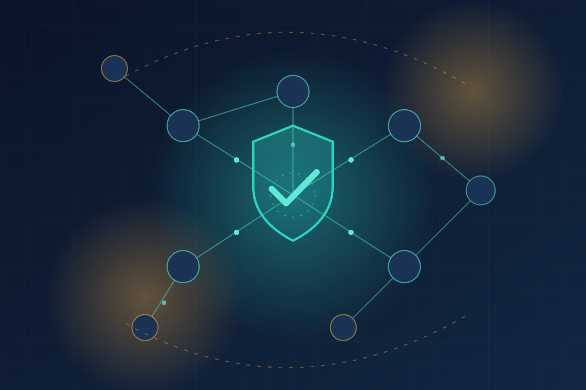

Cada equipo DevSecOps que está delegando remediación de vulnerabilidades a agentes IA debería leer esto: un paper publicado en arXiv (aceptado en el workshop LLMSec de ESORICS 2026) demuestra con números lo que muchos sospechábamos — **un LLM que parchea Kubernetes sin conocer la topología en vivo del cluster es una bomba de tiempo**.

## El problema

Los sistemas actuales de remediación automática toman los hallazgos de un scanner de posture (KSPM) y se los pasan al LLM aislados, asumiendo que el conocimiento genérico de seguridad basta. El problema: cuando el modelo toca un NetworkPolicy, un ServiceAccount o una credencial **sin ver las dependencias runtime que hay detrás**, el "fix" puede tumbar servicios downstream o cortar aristas de comunicación activas. El parche cierra la vulnerabilidad y abre un incidente.

## KuTIE: contexto antes de promptear

La propuesta se llama **KuTIE (Kubernetes Topology Intelligence Engine)** y es elegante en su simpleza: antes de invocar al LLM, construye un contexto vivo del cluster sintetizando tres capas:

- **Aristas de llamada de Istio**: los caminos reales de comunicación service-to-service
- **Hallazgos de Trivy KSPM**: misconfiguraciones y vulnerabilidades de los recursos desplegados
- **Bindings de ServiceAccounts**: identidades, roles y permisos que usan los workloads activos

Con eso, el modelo puede evaluar las consecuencias funcionales de un parche YAML **antes** de aplicarlo.

## Los números (248 trials)

Evaluado en **VulnCare**, un benchmark tipo cluster de salud con 36 deployments en 4 namespaces y 31 hallazgos inyectables:

- La corrección de parches topología-dependientes subió de **11,1% a 78,0%** al enriquecer el prompt con contexto de topología (+66,9 puntos)
- Las mayores ganancias: gestión de credenciales y NetworkPolicies (Δ = 0,95)
- RBAC fino mejoró Δ = 0,31
- El efecto se mantuvo en **todas las arquitecturas de modelo probadas**
- En hallazgos topología-independientes el contexto no cambió nada (Δ = 0,0) — prueba de que la ganancia viene de la topología y no de prompts más largos

## La letra chica

KuTIE **requiere service mesh** (Istio) para mapear las aristas de llamada. Sin observabilidad runtime detallada, no hay grafo que construir. Y no es bala de plata: una de las siete clases de dependencia no mostró mejora significativa, así que la validación de dominio sigue siendo necesaria.

## Por qué esto importa

Acá viene el punto que nos gusta subrayar: este paper es la demostración cuantitativa de que **la observabilidad dejó de ser un lujo de SRE y se volvió prerrequisito de la IA operacional**. El mismo telemetry stack que usas para debuggear (mesh, tracing, inventario de identidades) es ahora el contexto que evita que un agente IA rompa producción al "arreglarla".

Los pipelines de agentic remediation que no incorporan topología en vivo están operando con 11% de acierto en los casos que más importan. Con ella, 78%. Esa distancia es la diferencia entre un proyecto piloto y algo que puedes dejar suelto en producción.

## Enlaces
- [AI Breaking Wire - KuTIE AI Framework Improves Kubernetes Security Patches](https://aibreakingwire.com/news/kutie-boosts-llm-kubernetes-patch-accuracy-from-11-to-78)
