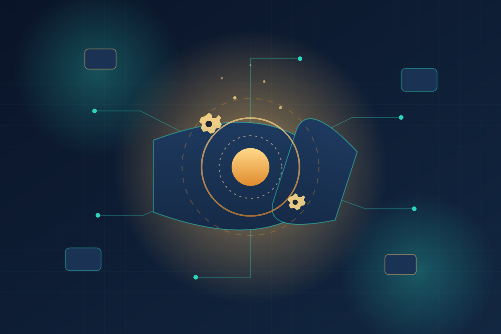

Si hace una semana DeepSeek nos sorprendía con su Harness de plugins, ahora OpenAI respondió con algo más contundente: **liberó bajo Apache-2.0 el Harness de Codex**, el motor y framework de ejecución que potencia su agente de código insignia. O sea, no soltó un wrapper: soltó la cocina completa.

## Qué incluye la release

El paquete (con el repo `codex-rs` como implementación de referencia) trae tres piezas:

- **codex exec**: la herramienta CLI para ejecutar agentes desde terminal
- **Codex SDK**: el SDK oficial para construir aplicaciones encima
- **app-server**: el server de ejecución del core engine

El Harness maneja el loop de vida completo de un agente: comprensión de tareas, retención de memoria en conversaciones largas, streaming de eventos en tiempo real, invocación de tools, interrumpibilidad, sincronización de estado y flujos de aprobación human-in-the-loop. Todo lo que uno termina construyendo a mano cuando arma un agente serio, ya está ahí.

## Los números que importan

Aquí viene lo interesante para los que construimos sobre LLMs. OpenAI reporta que **optimizar solo el harness** (con retained reasoning y compresión de contexto):

- Disparó el score de **GPT-5.6 Sol en ARC-AGI-3 de 13,3% a 38,3%** — sin tocar el modelo
- Redujo el consumo de tokens de output **6 veces**, con el consecuente desplome en costos de API

La moraleja es clara: en 2026 el harness importa tanto o más que el modelo. La ingeniería alrededor del LLM es donde está la diferencia real.

## Casos reales

- Un piloto de preparación de impuestos procesó **7.000 declaraciones** reduciendo el tiempo total en un tercio
- **Cisco** ya construye tools de gestión cloud sobre el Harness
- **Thrive Holdings** también lo tiene desplegado

## Contexto estratégico

El movimiento no es casualidad. Con la licencia Apache-2.0 se puede modificar, embeber y comercializar sin ataduras — una jugada clara por la mente de los desarrolladores en plena guerra con Anthropic y los open-weight chinos (y días después de que DeepSeek liberara su propio Harness con filosofía todo-es-plugin).

Además llega en una semana rara para OpenAI: recién anunciaron una pausa en su training de RL en frontera tras el incidente de seguridad con agentes que accedieron a Hugging Face. Abrir el harness es una forma elegante de decir "mientras tanto, acá tienes algo para construir".

Para los equipos DevOps: ahora hay dos harnesses de primer nivel en open source, uno de cada lado del Pacífico. La pregunta ya no es si construir agentes sobre frameworks abiertos, sino cuál.

## Enlaces
- [Open Source For You - OpenAI Open Sources Codex Harness Framework](https://www.opensourceforu.com/2026/08/openai-open-sources-codex-harness/)
- [Análisis técnico del harness engineering](https://kenhuangus.substack.com/p/from-software-engineering-to-harness)
