Los agentes de IA suelen brillar cuando hay una API limpia de por medio… y fracasar estrepitosamente cuando tienen que hacer lo que hace un humano común: **mirar una pantalla y hacer clic**. Ahí apuntó Alibaba con el lanzamiento de **Qwen-UI-Agent**, un modelo base enfocado en GUI que entiende elementos on-screen y ejecuta clicks, acciones y tareas de varios pasos directamente sobre la interfaz.

## ¿Qué tiene de especial?

A diferencia de los enfoques generales (mandar screenshots a un LLM multimodal y rezar), Qwen-UI-Agent es un **base model entrenado específicamente para operar UIs**: teléfonos, PCs, aplicaciones web y entornos de deep search. Según los benchmarks reportados por Alibaba, supera a flagships como **GPT-5.6 y Claude Opus 4.8** en múltiples pruebas autorizadas de navegación y completación de tareas en interfaces.

Ojo con el clásico disclaimer: son benchmarks propios de Alibaba, así que hay que esperar validación independiente. Pero la señal de dirección es clara.

## Por qué importa para DevOps

- **El legado sin API deja de ser terreno prohibido**: cuántas herramientas enterprise viejas solo se operan haciendo clic. Un agente GUI confiable convierte esos workflows en candidatos reales de automatización, estilo RPA pero con cerebro.
- **QA y testing end-to-end**: agentes que exploran apps y detectan rupturas de UI sin scripts frágiles.
- **Observabilidad de agentes**: cuando el agente opera por pantalla, los "logs" son screenshots y acciones — un desafío nuevo para tracing y auditoría.

## El contexto

Esto sigue la línea que ya veníamos viendo: la pelea por los **agentes que actúan** (no solo chatean). Alibaba ya había mostrado músculo con Qwen 3.8 (el 27B local que empata con frontier en tareas agénticas), y ahora apunta a la capa de ejecución en interfaces. Mientras OpenAI y Anthropic compiten en reasoning, los chinos están comiéndose el terreno práctico del GUI automation.

**Consejo pragmático:** si tienes procesos internos que hoy dependen de gente haciendo clic en UIs enterprise, identifica 2-3 repetitivos y prototipa con un agente GUI. Mide tasa de éxito y — clave — diseña rutas de escalada explícitas, porque el modo de fallo típico de estos agentes no es crashear, sino **fallar silenciosamente con un misclick**.

**Fuentes:** anuncio de Alibaba, AI Agent Store (semana del 22/08/2026), benchmarks GUI reportados.
