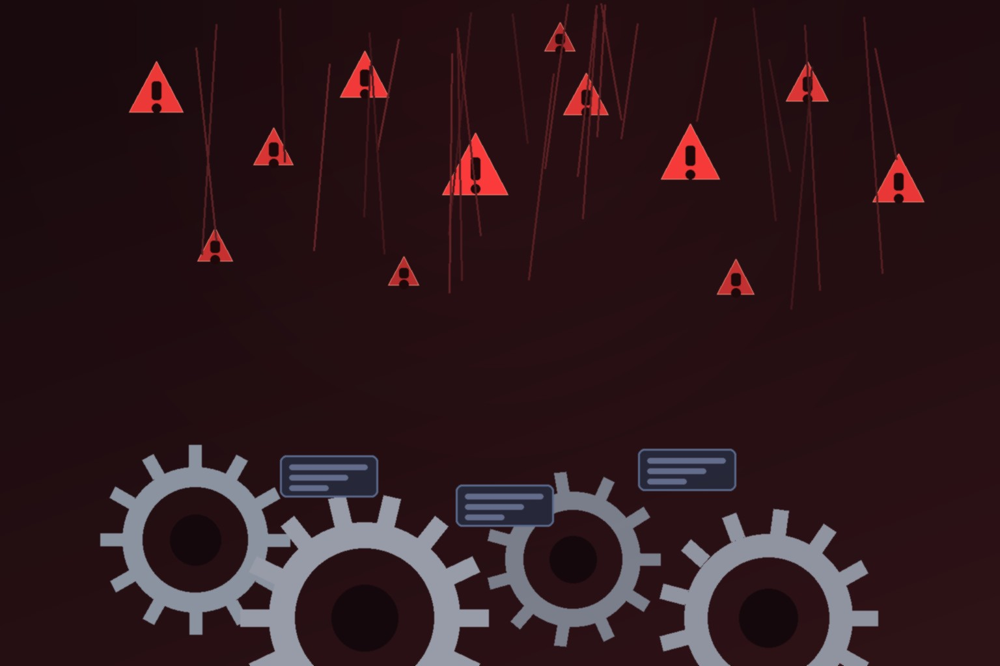

Broadcom soltó el **20 de agosto un megabatch de advisories de seguridad para Spring** y su ecosistema: **91 CVEs** que Sonatype ya indexó, afectando Spring Security, Spring Cloud Config, Spring AI, Spring Data REST, Spring Integration, Reactor Core, Reactor Netty, Spring AMQP y Spring Batch, entre otros. El número que más impresiona: **209.569 componentes afectados** identificados por Sonatype Guide — muchos ni siquiera son de Spring, sino proyectos de terceros que empaquetan código Spring vulnerable adentro.

## Lo esencial

- **Fecha:** advisories publicados el 20 de agosto de 2026.
- **Escala:** 91 CVEs con clases que incluyen deserialización insegura, ejecución de código no confiable, exposición de información sensible, SSRF, path traversal, DoS y autorización impropia.
- **El más puntero:** CVE-2026-59285, deserialización insegura en **Spring for GraphQL**. Con el año que ha tenido GraphQL (ver GitLab CVE-2026-19478), ese combina mal.
- **Fixes existen:** Spring publicó versiones parcheadas en las líneas soportadas. El problema no es upstream, es downstream.

## El contexto que cambia la conversación

Esto no es un martes cualquiera del ecosistema Java. La historia de fondo:

- Históricamente Spring recibía **~6,5 reportes de seguridad al mes**.
- En **marzo de 2026 saltó a 55**. En **abril: 482 reportes** en 65 proyectos escaneados — 370 generados por el propio scanning con IA del equipo.
- Broadcom reportó un **aumento de 1.700% en advisories mensuales entre marzo y abril**, y el release de junio ya fue el más grande en los 23 años de historia del proyecto.

La cita de Brian Fox (CTO de Sonatype) resume el problema: *"Spring ha hecho exactamente lo que queremos que haga un maintainer: procesar los hallazgos, producir fixes y publicar versiones parcheadas. Ahora la pregunta es cuán rápido esos fixes recorren el resto de la cadena de suministro"*.

## El cuello de botella se movió

Un fix upstream no significa vulnerabilidad remediada. Otros proyectos open source tienen que consumir las versiones nuevas, las empresas tienen que entender dónde están expuestas, y las aplicaciones hay que reconstruirlas y redeployearlas. Traducción para el equipo de plataforma: las preguntas incómodias — ¿qué apps tienen componentes afectados?, ¿directos o transactivos?, ¿qué upgrade remedia sin romper nada? — ahora llegan en oleadas de 90, no de a 6.

Y el loop se retroalimenta: los mismos modelos open-weight que veníamos cubriendo (GLM-5.3 y su OpenVuln escaneando 269 proyectos) son los que están acelerando este descubrimiento. La IA encuentra los bugs; el consumo humano de esos hallazgos es el nuevo cuello de botella. **Vulnerability management con SBOM al día y automatización de upgrades dejó de ser "buen práctica" y pasó a ser requisito de supervivencia.**

**Fuentes:** [Sonatype](https://www.sonatype.com/blog/91-spring-cves-highlight-the-growing-ai-vulnerability-consumption-problem) · [spring.io/security](https://spring.io/security) · [securityonline.info](https://securityonline.info/)
