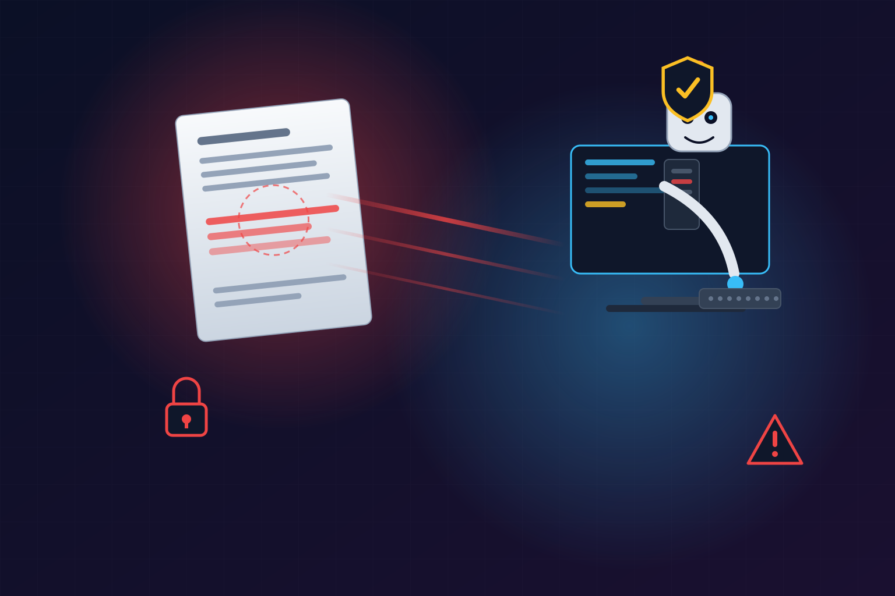

Si usas Cursor, Claude Code o Windsurf, hay buenas chances de que tengas **Context7** instalado como servidor MCP. Es el conector que le entrega documentación actualizada de librerías a tu agente de código, y es gigante: **61.000 estrellas en GitHub y más de 4 millones de descargas mensuales en npm**. Justamente ese, el del presente en todos lados, es el que acaba de quedar en el ojo del huracán.

## El bug

**CVE-2026-75130**, publicado en el NVD el 18 de agosto: una vulnerabilidad de **prompt injection en Context7 hasta la versión 2.1.2**. El mecanismo es incómodamente simple: la función **Custom AI Instructions** puede inyectar instrucciones sin sanitizar directamente en el contexto del agente de código conectado, en el momento en que este hace un request rutinario de documentación. El advisory oficial dice que ese camino puede llegar a **credenciales en archivos .env y disparar borrado destructivo de archivos** — no porque el servidor MCP pueda hacerlo por sí solo, sino porque el agente que alimenta sí puede.

Clasificación: **CWE-1427**, "Improper Neutralization of Input Used in LLM Prompting". Crédito de investigación: Eli Ainhorn de Noma Security.

## Un bug, dos veredictos

Acá viene lo pedagógico: el mismo advisory carga **9.0 crítico bajo CVSS 3.1 y 6.4 medio bajo CVSS 4.0**. Mismo bug, bandas de severidad opuestas. La divergencia está en cómo cada versión de la métrica pondera el contexto de ejecución — y es un adelanto de la discusión que viene para todo el ecosistema de seguridad de agentes: ¿cómo puntúas un bug cuyo daño real depende de los permisos del agente que lo recibe y no del servidor vulnerable?

## Lo que más preocupa: el fix

A la fecha (22 de agosto), **no hay fix público documentado para el rango afectado** (2.1.2 y anteriores). El lío de versiones no ayuda: el advisory está anclado a un build de febrero, pero el paquete npm ya va por la línea 4.0.x. ¿Regression de un bug parchado en febrero? Los análisis apuntan a que sí, pero sin confirmación oficial del vendor en el registro.

## Qué hacer en la práctica

- **Audita si lo tienes instalado** y qué versión (`npm ls @upstash/context7-mcp`).
- Si tu agente corre con credenciales en variables de entorno y permisos amplios de filesystem, **trátalo como exposición real**: el vector no es exótico, es el flujo normal de trabajo.
- Considera restringir los permisos del agente (allowlists de herramientas y rutas) en vez de confiar en que el servidor MCP se comporte.
- Vigila el repo de Upstash por un fix documentado para el rango afectado.

La lección de fondo para los que armamos stacks de agentes: **el perímetro de seguridad ya no es el servidor, es el contexto del modelo**. Cada MCP que conectas es una superficie de inyección potencial, y esta vez le tocó al más popular de todos.

**Fuentes:** [NVD](https://nvd.nist.gov/vuln/detail/CVE-2026-75130) · [VulnCheck](https://www.vulncheck.com/advisories/context7-prompt-injection-via-custom-ai-instructions) · [Digital Applied](https://www.digitalapplied.com/blog/context7-mcp-prompt-injection-cve-2026-75130)
