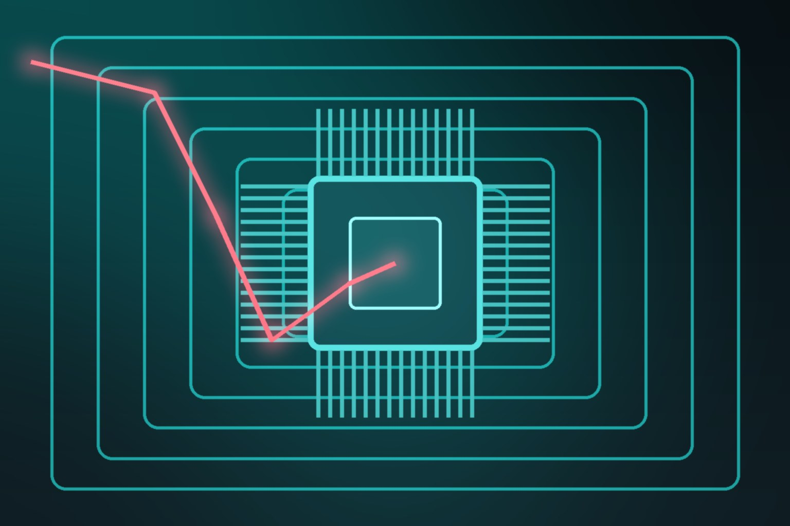

Si te gustan los ataques a nivel hardware, agarra un café: el investigador de seguridad Christopher Domas publicó **skitter-creek-bath-salts**, un proyecto open source que rompe los límites de privilegio tradicionales de la CPU apuntando a la capa más baja de la jerarquía de memoria física: **los registros de traducción del controlador DRAM**.

## ¿Cómo funciona la magia?

La seguridad de procesadores modernos asume que las direcciones físicas mapean de forma determinista a ubicaciones específicas del silicio. Los mecanismos de protección estándar —Extended Page Tables del hipervisor, límites TSEG del System Management Mode, carveouts privados del Platform Security Processor— operan en la capa del core y del fabric, **antes** de que el tráfico llegue al controlador de memoria.

Y ahí está el hueco: Domas descubrió que los registros de traducción del controlador quedan **debajo** de esas vallas de control. Manipulando bits de configuración como `BankSwizzleMode`, se cambia fundamentalmente cómo el controlador calcula coordenadas de banco, fila y columna en la DRAM. Como los filtros upstream solo validan la dirección física **sin traducir**, estos bit-flips permiten que accesos de memoria estándar caigan silenciosamente dentro de enclaves protegidos —sin excepciones, sin faults, sin que nadie se entere.

## Un pipeline digno de laboratorio

Para extraer datos de memoria scrambled sin crashear el SO, el exploit usa una cadena multi-etapa:

- Un módulo de kernel Linux custom que **desconecta los cores no-boot, flushea cachés, pre-calienta TLBs y desactiva interrupciones**
- Scripts de probing con heurística *coupon-collector* para catalogar colisiones de bits de dirección
- Modelado de la permutación física con **aritmética de Galois Field** y un solver SMT para derivar el mapeo exacto
- Ráfagas de lectura/escritura dirigidas contra SMM RAM, tablas de firmware del PSP, áreas de guardado CC6 y **buffers de microcode patches**

## ¿A quién le importa?

El hallazgo expone un punto ciego arquitectónico directo para **bare-metal cloud y confidential computing**: si la lógica del controlador de memoria permite *address swizzling* dinámico, los chequeos de seguridad upstream no garantizan integridad de los datos en reposo.

El detalle: en procesadores AMD Family 14h, 15h y 16h, software en Ring 0 puede manipular estas configuraciones. O sea, el modelo de confianza que trata al kernel como inherentemente confiado queda insuficiente — la distinción entre **privilegio de CPU y privilegio de plataforma** nunca quedó tan clara.

Para equipos de infraestructura: si corres workloads sensibles en bare metal multi-tenant, esto agrega otra capa a la lista de por qué el aislamiento por software tiene límites físicos.

Fuentes: InfoQ, GitHub (xoreaxeaxeax/skitter-creek-bath-salts).
