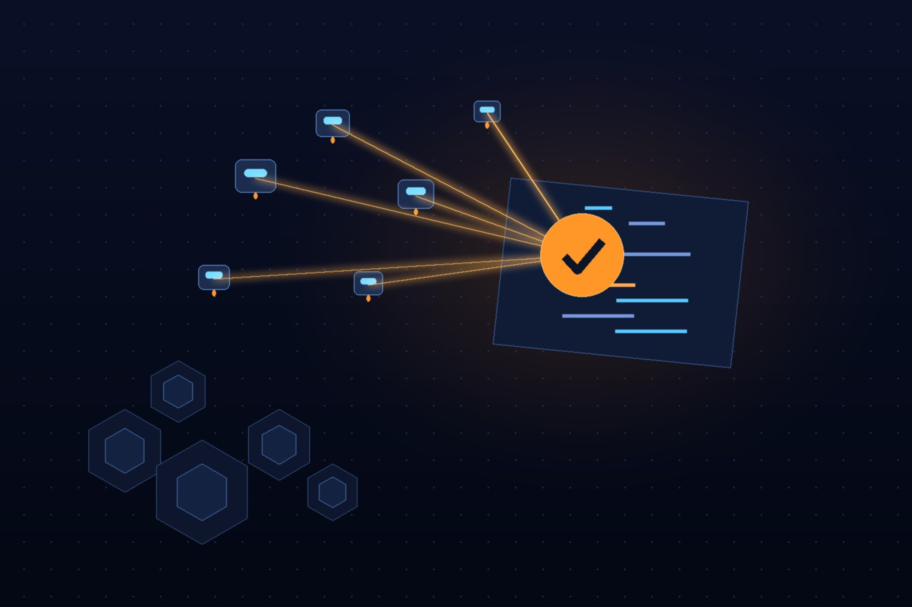

La ecuación es simple y brutal: los agentes de coding están botando más código por developer que nunca, los reviewers humanos no dan abasto, y el P90 de tiempo a primera review humana se fue a las nubes. La respuesta obvia — "pon un bot de IA frente a GitHub" — resulta ser la parte fácil. Lo difícil es que los comentarios sean buenos.

## Qué construyó LinkedIn

LinkedIn publicó esta semana los detalles de su plataforma de **code review multi-agente**, y lo interesante no es el "IA revisa tu PR" sino cómo lo abordaron: como **infraestructura de producción**, no como un plugin bonito.

Los tres problemas estructurales que identificaron con los reviewers genéricos:

- **Punto ciego de modelo único:** un solo modelo falla siempre en la misma clase de bugs y repite los mismos falsos positivos.
- **Customización insuficiente:** imposible codificar simultáneamente políticas del org completo, convenciones por repo y conocimiento tribal.
- **Sin control operacional:** no puedes monitorear, evaluar ni tunear el reviewer como parte de tu infra.

Su arquitectura ataca los tres: **múltiples reviewers de IA independientes** con modelos y enfoques de razonamiento distintos que se cross-validan entre sí. Cuando varios agentes llegan al mismo hallazgo por caminos separados, esa convergencia se trata como evidencia fuerte. Los hallazgos únicos no se descartan, pero se verifican aparte. Y todo lo cosmético o irrelevante se filtra antes de postear.

## Los números que importan

Aquí está la carne del asunto. LinkedIn construyó un pipeline automático que compara cada sugerencia contra el código final mergeado — la métrica honesta, no "¿sonó convincente?" sino "¿el developer la aplicó?".

Sobre una muestra de **5.230 comentarios en 1.727 PRs**:

- **63,9% de aceptación global** de las sugerencias
- **80%** en errores de lógica
- **100%** en bugs de concurrencia (sí, cien)
- **58,1%** en bug fixes
- **43,5%** en refactoring
- **40,6%** en fixes de seguridad

Que los fixes de seguridad sean los que menos se aceptan dice algo incómodo: o el modelo exagera riesgos, o los developers siguen subestimando lo que el bot les avisa. Probablemente un poco de ambos.

## El detalle que nos gusta: Kubernetes en el core

La plataforma corre sobre una **arquitectura basada en Kubernetes** con pipeline event-driven, colas durables y workers escalados horizontalmente. Monitorean latencia, tasas de aceptación y finalización, y hasta las fallas del proveedor de modelos.

O sea: la infra que nació para microservicios terminó siendo el chassis natural para orquestar enjambres de agentes de IA. Cada reviewer es otro workload con su SLO.

## Contexto

No están solos en esto: Cloudflare armó su sistema alrededor del agente open source OpenCode, y Databricks soltó Unity AI Gateway y Omnigent para gestionar lo que llaman el "crecimiento exponencial de los costos de coding con IA". La diferencia de LinkedIn es el nivel de detalle en cómo miden la señal — eso de evaluar contra el código mergeado y publicar los números reales, incluidos los feos, se agradece.

La lección para cualquier equipo platform: el code review con IA no es un feature, es un sistema distribuido con métricas, validación cruzada y feedback loops. Si lo tratas como un wrapper de API, tus developers aprenden a ignorarlo en dos semanas.

---

**Fuentes:** [LinkedIn Engineering Blog](https://www.linkedin.com/blog/engineering/ai/high-signal-ai-code-review-that-adapts-to-your-codebase-at-scale), [InfoQ](https://www.infoq.com/news/2026/08/linkedin-ai-code-review/)
