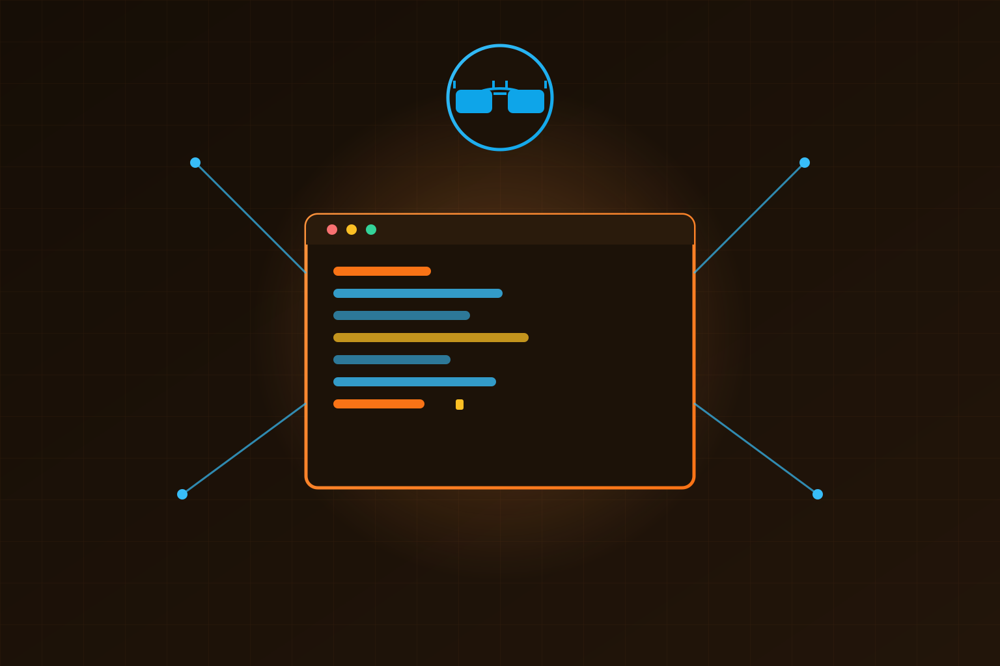

La familia **GPT-5.6** (Sol, Terra y Luna) ya está disponible en **Kiro**, el agente de desarrollo de software de AWS. Y OpenAI no vino solo: la integración la trabajaron codo a codo con AWS, con un número llamativo bajo el brazo — **~82% de reducción de costo** en tareas completadas.

## Qué trae la jugada

Kiro es un agente que lleva rigor de ingeniería al coding asistido a escala: convierte intención de alto nivel en requerimientos claros, diseños técnicos y tareas ejecutables, y ancla al modelo al codebase y a los estándares del equipo.

Con GPT-5.6 adentro, los equipos pueden:

- Convertir ideas de producto en planes de implementación estructurados
- Completar tareas multi-paso de código con más consistencia
- Trabajar con **desarrollo spec-driven**: requisitos y diseño claros desde el inicio
- Revisar el trabajo del modelo en checkpoints antes de implementar cambios
- Validar la implementación con **property-based testing**

## El número que importa

OpenAI y AWS optimizaron el entorno de Kiro junto a los modelos. El resultado, medido en **Terminal-Bench 2.1**: GPT-5.6 **Terra** completó tareas con ~82% menos costo. La lógica es que el enfoque spec-driven mantiene al modelo pegado a los requisitos desde el arranque, así llega a soluciones que funcionan con menos pasos en falso.

Traducido: menos tokens quemados en iteraciones que no sirven y más trabajo terminado por dólar. Para equipos que corren agentes de código a escala, ese es exactamente el tipo de métrica que justifica el presupuesto.

## Por qué importa

Esto refuerza una tendencia que ya veníamos viendo: **la competencia en agentes de desarrollo se está jugando en el costo por tarea completada**, no solo en el puntaje de benchmark. Y el acople OpenAI-AWS suma presión a la pelea de plataformas, con Kiro posicionándose como el lugar donde la familia GPT-5.6 rinde mejor por token.

La familia GPT-5.6 ya está disponible en Kiro vía [kiro.dev](https://kiro.dev/).

Fuentes: OpenAI (gpt-5-6-in-kiro).
