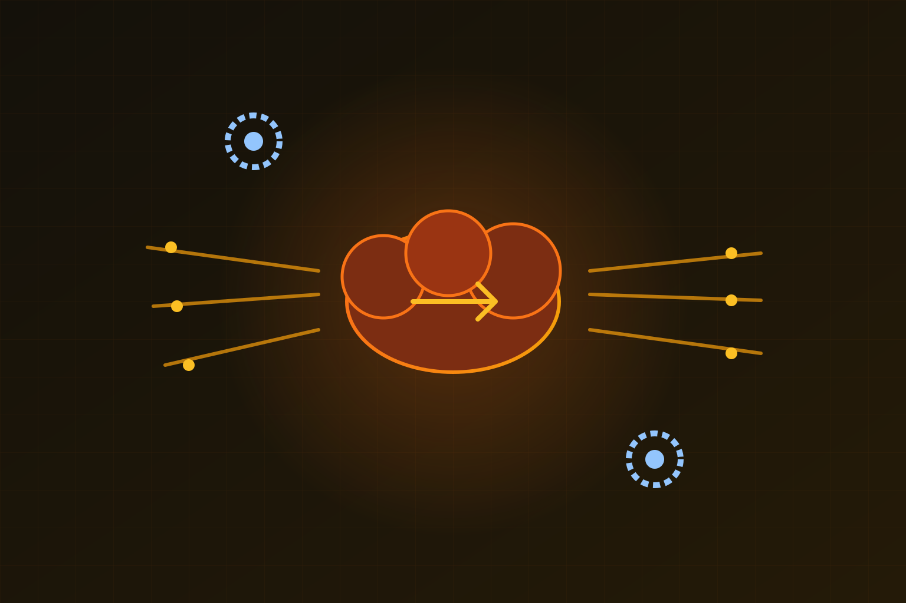

Si notaste que el blog de Cloudflare cambió de cara (dark mode, look más moderno), no fue solo cosmética. Detrás hubo una migración grande: el **miércoles 12 de agosto** movieron el blog a **EmDash**, un CMS construido para funcionar sobre **Astro** y con Cloudflare.

Y como es Cloudflare, lo hicieron bajo su principio de **Customer Zero**: ellos mismos son su primer y más exigente cliente.

## Customer Zero, de verdad

La lógica interna es dura: si quieres usar un vendor externo, la carga de la prueba recae sobre ti. ¿Por qué ese equipo no puede soportarte? ¿Qué gaps hay? ¿Esos "gaps" son requerimientos reales? Está hasta en su Codex interno de estándares de ingeniería: *"no construimos productos solo para otros; los construimos para correr Cloudflare. Si un producto se rompe, nos rompe a nosotros primero."*

Con EmDash recién lanzado (pre-1.0) y limitaciones con su CMS anterior, la decisión fue casi obvia: probarlo a la escala del blog de Cloudflare.

## ¿Funciona y escala?

La migración partió con dos preguntas: **¿EmDash funciona para nosotros?** y **¿puede escalar?**.

Para la primera, corrieron los flujos comunes —publicar, despublicar, crear posts, agendar, agregar media— y EmDash aguantó. Los gaps que encontraron fueron sobre todo de **escala y matices**: media, búsqueda de entidades de contenido, bylines, localización, SEO y Content Security Policies (CSPs).

La segunda pregunta la respondieron estresando la plataforma a escala de producción real: enrutando tráfico de forma segura, midiendo performance y rediseñando el frontend. El resultado es que EmDash terminó más robusto para todos sus usuarios gracias al uso interno de Cloudflare.

## El mensaje para DevOps

La historia no es solo de un blog bonito. Es un caso concreto de **dogfooding a escala**: usar tu propio producto en una carga de producción real, antes de que lo toque un cliente que paga. Si el producto se rompe, te rompe a ti primero, y eso te obliga a arreglarlo rápido. Para equipos que predican "comete tu propia comida", Cloudflare acaba de mostrar cómo se hace cuando tu blog tiene el tráfico que tiene el de ellos.

Fuente: Cloudflare Blog (cloudflare-blog-uses-emdash).
