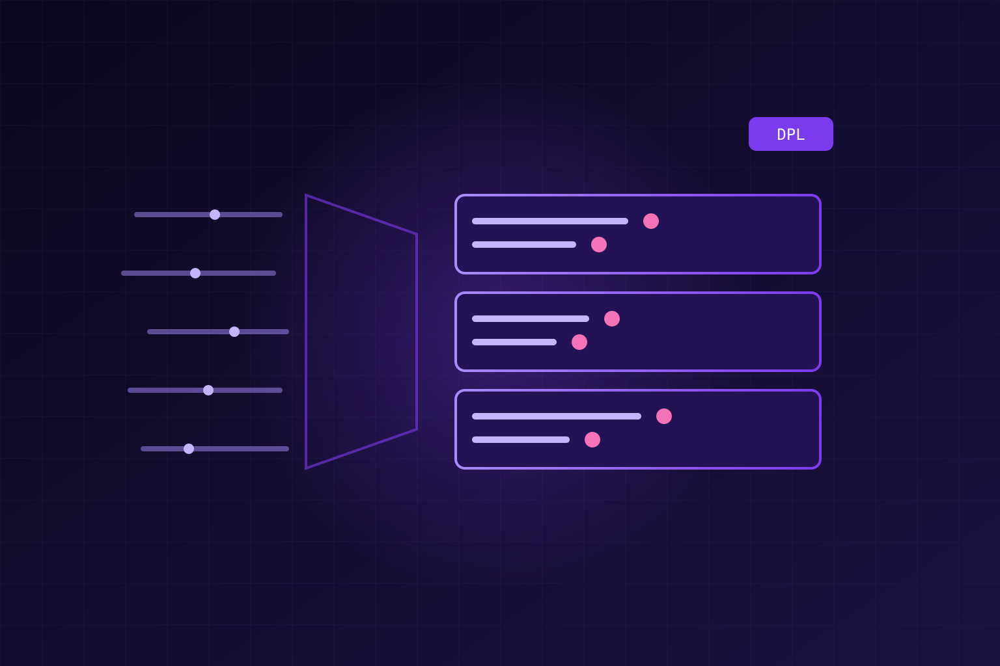

Cualquiera que haya buceado en logs lo sabe: un solo clúster Kubernetes puede generar **miles de mensajes casi idénticos en minutos**, salidos de decenas de servicios sin estructura consistente. Encontrar la señal entre tanto ruido suele terminar en filtros interminables, exploración manual o queries complejas.

Dynatrace responde con **log pattern analysis**, ahora en **preview**, que identifica patrones recurrentes en logs de texto libre con un solo clic. Agrupa automáticamente los mensajes similares y marca las partes variables, separando la señal del ruido sin escribir una línea de código.

## Cómo funciona

El análisis agrupa logs comparando su estructura de contenido y aísla los campos variables —timestamps, IPs, números, texto libre— en *tokens* distintos del texto estático. Esos registros se fusionan en clusters que comparten un mismo mensaje base: un patrón repetido.

Lo que antes eran 1.000 registros dispersos entre 100.000 logs se convierte en **un solo patrón que ocurrió 1.000 veces**, y el análisis se aplica en segundos, en vivo y a nivel de query. Todo impulsado por Dynatrace Intelligence y respaldado por **Grail**, su data lakehouse unificado, que permite revisar millones de eventos de log en pocos segundos.

## De descubrir a actuar

Identificar el patrón es solo el primer paso. Al detectar uno, la app de Logs genera automáticamente una query en **Dynatrace Query Language (DQL)** con una declaración de **Dynatrace Pattern Language (DPL)**, lista para reutilizar en toda la plataforma. Con eso puedes:

- Armar dashboards y visualizaciones
- Crear queries analíticas con DQL
- Configurar procesadores en OpenPipeline
- Disparar automatizaciones y workflows
- Estandarizar la lógica de parsing entre equipos

Puedes aplicar segmentos pre-filtrados de los expertos de dominio, filtros exploratorios, o ventanas de tiempo desde minutos hasta semanas. Los resultados llegan pre-ordenados por severidad y frecuencia.

## Por qué importa

El patrón se está repitiendo en observabilidad: **bajar la barrera técnica para ir del dato crudo a la acción**. Dynatrace lo empuja con una capa de inteligencia que convierte logs masivos en insights estructurados y reutilizables, sin obligar a escribir queries a mano. Para equipos que viven pegados a los logs, es tiempo que deja de gastarse en buscar y se invierte en resolver.

Fuente: Dynatrace Blog (logs pattern analysis, preview).
