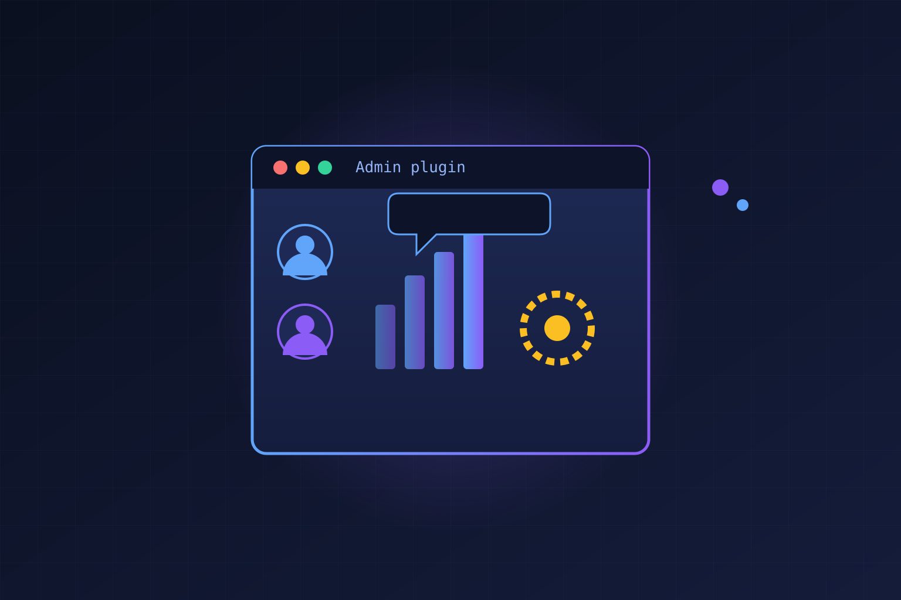

Si algo duele en los workspaces de ChatGPT que están creciendo, es la administración: saltar entre analytics, settings y reportes para entender qué pasa y poder actuar. OpenAI acaba de atacar eso con el **Admin plugin** para **ChatGPT Work** y **Codex**, una forma de hacer las tareas de admin directamente desde la conversación.

La idea es simple: en un mismo chat puedes preguntar, explorar el detalle, hacer un cambio autorizado y confirmar el resultado, sin escribir prompts rebuscados ni andar cambiando de herramienta.

## Qué se puede hacer

El plugin expone las capacidades del Admin Console como herramientas *permission-aware*, es decir, respetando el rol y los permisos que ya tiene cada usuario. Lo que se puede hacer hoy:

- **Entender adopción y uso**: revisar actividad y consumo de créditos en ChatGPT Work y Codex, detectar quién o qué grupo se acerca al límite.
- **Gestionar miembros y grupos**: altas, bajas, onboarding, offboarding y cambios de equipo.
- **Manejar accesos y permisos**: revisar permisos efectivos, diagnosticar problemas de acceso y controlar features o modelos por rol o grupo.
- **Administrar límites y gastos**: ajustar límites, revisar solicitudes contra el uso actual y aprobar o rechazar con contexto.

## Automatizaciones sin ingeniería

Lo que más llama la atención es la capa de **automatización de workflows recurrentes** sin escribir código propio. Por ejemplo, el plugin puede rutear solicitudes de uso pendientes a Slack o Microsoft Teams para que un revisor las apruebe o rechace desde la herramienta que ya usa. También puede monitorear solicitudes de acceso a features y otorgarlas automáticamente cuando cumplen criterios predefinidos, dejando las excepciones para revisión humana.

En todos los casos el admin mantiene el control: cada workflow confirma cuándo se aplicó el cambio solicitado.

## El detalle de gobernanza

Punto importante para equipos de seguridad: el plugin **no otorga más acceso del que ya tienes**. Detrás de cada request, mapea la instrucción del admin a la acción de lectura o escritura correspondiente y devuelve un resultado estructurado. Para cambios de mayor impacto, el admin puede revisar la acción antes de que se aplique.

OpenAI lo usa internamente: su equipo de IT global lo describe como un cambio de enfoque, donde la pregunta se conecta directo con la siguiente acción (chequear permisos efectivos, actualizar un grupo, cambiar un límite o revisar un gasto), preservando los mismos controles de siempre.

Para el mundo enterprise, el mensaje es directo: **la administración de workspaces de IA se está volviendo conversacional**, y el admin plugin es otro paso en esa dirección.

Fuente: OpenAI (introducing-admin-plugin).
