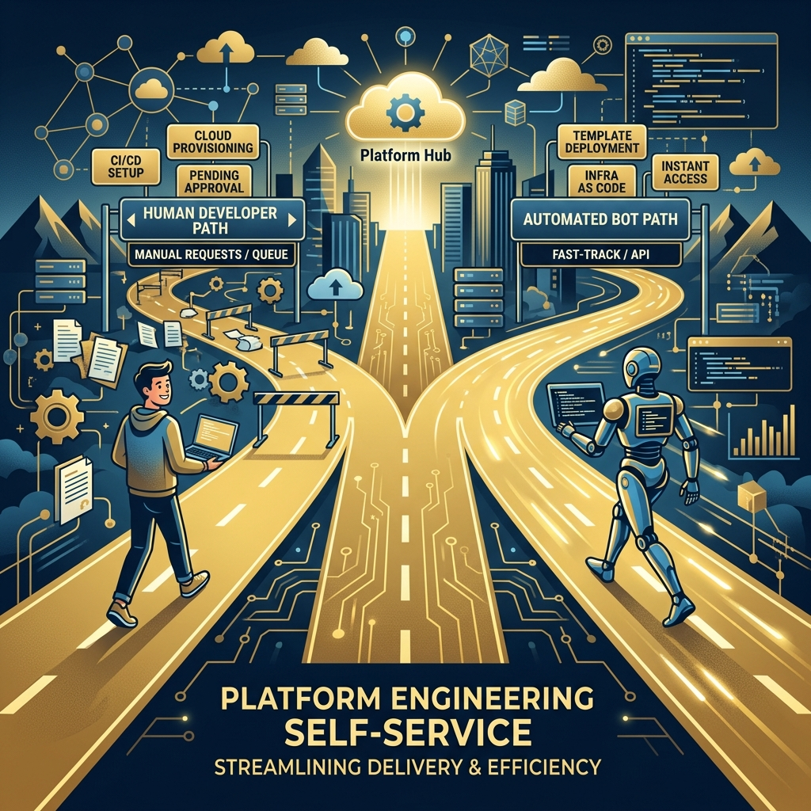

Si tu plataforma interna tiene Golden Paths (esos caminos pavimentados que guían a los devs hacia las buenas prácticas), hora de aceptar algo incómodo: **ya no todos los que los recorren son humanos**. Datadog publicó "Golden Paths for AI agents", una guía sobre qué cambia cuando los usuarios de tu plataforma son agentes autónomos consumiendo APIs y provisionando recursos a las 3 de la mañana.

## El contexto: los agentes ya son un "persona" formal

No es especulación: según el Hype Cycle de Agentic AI 2026 de Gartner, los agentes tuvieron la curva de adopción más agresiva de cualquier tecnología emergente, al punto que **Gartner los trata como un user persona formal** y habla de "agent experience (AX)" como disciplina.

En la práctica, los agentes ya están llamando las APIs self-service de las plataformas, consultando catálogos y provisionando recursos sin supervisión. La pregunta de los platform teams cambió de "¿deberíamos dejar que los agentes usen la plataforma?" a "¿cómo evoluciona la plataforma ahora que ya lo hacen?".

## Qué cambia en los Golden Paths

Datadog identifica tres frentes de adaptación:

- **Match entre path y workload**: los Golden Paths deben alinearse con los requerimientos y límites de control del agente, no solo con el flujo de un dev humano. Un agente no "descubre" la plataforma navegando una wiki: ejecuta patrones intencionales.
- **Contratos consumibles por máquinas**: las instrucciones ambiguas que un humano interpreta sin problema (o con un poco de contexto) son trampas para un agente. Los caminos necesitan contratos explícitos y ejecutables, no documentación aspiracional.
- **Controles de dispatch**: cómo encajar y despachar los agentes dentro de la plataforma, para que el trabajo autónomo respete límites sin frenar la automatización.

## Por qué le importa a tu equipo

El post llega al mismo punto que venimos viendo en el ecosistema (Shopify y los archivos de contexto, MCP como capa estándar): **la capa de "cómo le explico a un bot cómo trabajar acá" se volvió infraestructura de primera clase**. Las IDPs que diseñen sus Golden Paths pensando solo en humanos van a terminar con agentes improvisando atajos fuera del camino pavimentado, que es exactamente lo que los Golden Paths existían para evitar.

La movida completa de Datadog apunta a platform engineering con observabilidad embebida: si los agentes son usuarios, también necesitan rails, telemetría y límites claros. Bienvenida la AX.

Fuentes: Datadog blog "Golden Paths for AI agents" (25-08-2026), Gartner Hype Cycle for Agentic AI 2026.
