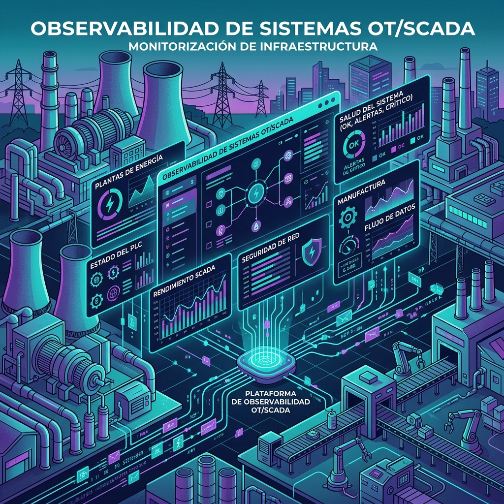

Hay una capa de tecnología que sostiene todo y que casi nadie del mundo cloud mira: el **operational technology (OT)**. El agua que sale de tu llave, los peajes de la autopista, el gas que prende la cocina y la luz de tu ciudad no corren sobre una web app ni un dashboard móvil. Corren sobre sistemas industriales que, cuando fallan, no te muestran un error 500: pueden generar crisis de seguridad pública, daño ambiental o cortes masivos.

Dynatrace publicó hoy "Bring observability to SCADA systems in operational technology environments", y el timing es bueno: el OT se está conectando cada vez más al mundo enterprise, y con eso aparece un problema de visibilidad donde más importa.

## SCADA, el sistema nervioso del OT

Detrás de casi todo entorno OT hay un **SCADA** (Supervisory Control and Data Acquisition): el framework que recolecta datos en tiempo real de sensores y equipos de campo, se los muestra a los operadores y manda comandos al hardware físico. La analogía que usa Dynatrace es clara: los sensores son las terminaciones nerviosas, los **PLC** (Programmable Logic Controllers) son la médula espinal y el servidor SCADA es el cerebro.

La arquitectura típica tiene cuatro niveles: campo (sensores/actuadores), control (RTUs y PLCs), supervisión (servidor SCADA) y enterprise (historiadores e integración con IT). Ese modelo calza directo con el **Purdue Enterprise Reference Architecture (PERA)**, el estándar de facto para segmentación IT/OT que referencian IEC 62443 e ISA-95.

## Por qué es un punto ciego

El drama de fondo es que los sistemas SCADA existen hace décadas y fueron construidos para confiabilidad en entornos aislados y de propósito único, donde la estabilidad valía más que la visibilidad. Protocolos propietarios, aislamiento de red y hardware hecho a medida hicieron que monitorearlos con herramientas IT tradicionales fuera difícil — a veces imposible. Resultado: **brechas de visibilidad justo en los entornos donde la visibilidad es más crítica**.

Los ejemplos que pone el post no son cosméticos:

- **Agua potable**: una falla en el control de dosificación puede meter niveles incorrectos de cloro u otros químicos al suministro, con consecuencias potencialmente letales para comunidades enteras.
- **Minería**: el OT monitorea ventilación subterránea y concentración de gases. Un fallo en detección de gas o control de ventilación pone a los trabajadores en peligro físico inmediato, y un fallo de monitoreo de tranques de relaves es riesgo ambiental catastrófico.
- **Energía**: un punto ciego de monitoreo puede escalar a apagones que tumban hospitales, transporte y hogares.

## El mensaje

A diferencia del IT —donde existe degradación elegante y un "reintenta más tarde"—, en el OT **la confiabilidad no es una feature, es la línea base**. No hay margen para "lo arreglamos en la próxima release".

La movida de Dynatrace es llevar su pila de observabilidad a ese mundo: conectar la telemetría de SCADA/OT a las mismas herramientas que ya miran tu nube, y cerrar la brecha IT/OT que la convergencia está abriendo. Para equipos de infraestructura que operan en manufactura, energía, minería o utilities, esto es señal de que la observabilidad industrial dejó de ser nicho y se está volviendo parte del stack estándar.

Fuente: Dynatrace blog "Bring observability to SCADA systems in operational technology environments" (26-08-2026).
