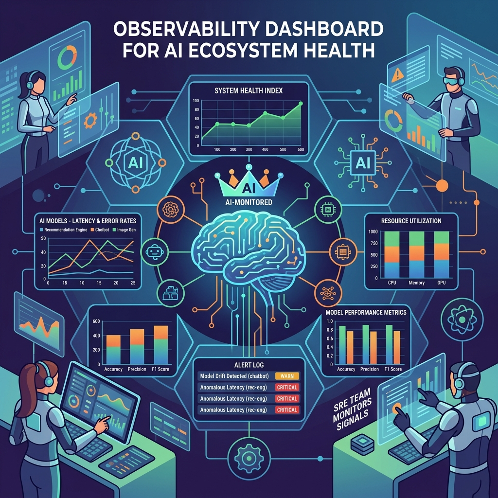

Dynatrace publicó su investigación **State of SRE and Platform Engineering 2026**, y el resumen es una frase: los workloads de IA dejaron de ser experimento y pasaron a ser responsabilidad operacional de los equipos de SRE y platform engineering. Con todo lo que eso implica en confiabilidad, costo y monitoreo.

## Los números que importan

- **Monitorear sistemas de IA es hoy el use case n°1 de los SRE: 58%** lo señala como su prioridad principal.
- **67%** exige funciones con IA como capacidad más importante de su plataforma de observabilidad. Traducción: IA para operar la IA.
- Los platform engineers priorizan **soporte de desarrollo con IA (55%)** y dashboards de observabilidad self-service (**74%**) a través de plataformas internas de desarrollador (IDPs).
- Casi **70%** embebe seguridad y cumplimiento en platforms-as-code, y más de **60%** lo hace directo en los pipelines de CI/CD.

## Por qué esto no es "otro study más"

El informe marca un cambio estructural en la función: **los workloads de IA fallan distinto** que el software tradicional. Las señales clásicas de confiabilidad (latencia, errores, saturación) ya no alcanzan; ahora hay que sumar indicadores de salud de IA: drift, calidad de respuestas, costos por token, comportamiento del modelo en producción.

Y aparece el gap que todos los que operan este tipo de sistemas conocen: **las herramientas para evaluar IA en desarrollo están separadas de las plataformas que la observan en producción**. A medida que más proyectos pasan de piloto a producción, la continuidad entre evaluación y observabilidad se vuelve el cuello de botella.

## El mensaje para el equipo

Si trabajas en SRE o plataforma, la agenda 2026 te incluye sí o sí: confiabilidad de aplicaciones de IA, automatización confiable para operar esas mismas cargas, y observabilidad que cubra tanto las señales tradicionales como los nuevos indicadores de salud de IA. La investigación completa está disponible en el sitio de Dynatrace para quien quiera el detalle por segmento.

Spoiler: entre este estudio, los Golden Paths para agentes y la pelea de Shopify por los archivos de contexto, la conclusión de la semana es la misma — **la operación de IA ya es un problema de plataforma, no de data science**.

Fuentes: Dynatrace blog "SRE best practices and platform engineering trends" (25-08-2026), State of SRE and Platform Engineering 2026.
