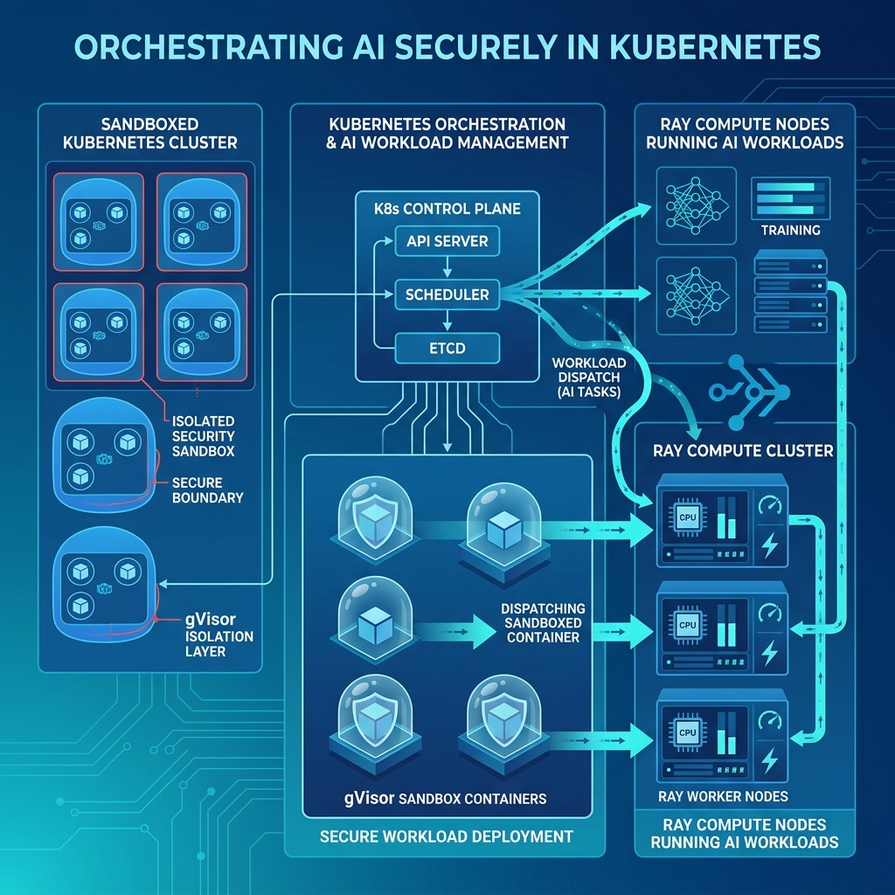

Ray se está consolidando como el runtime de cómputo unificado para las cargas de reinforcement learning (RL) y post-training. Frameworks como veRL, NeMo-RL, SLIME, MILES y SkyRL ya lo usan para coordinar trainers distribuidos, motores de inferencia y rollouts. El cuello de botella que apareció, según Google Cloud, es otro: **orquestar sandboxes seguros y aislados a escala** para ejecutar rollouts dinámicos, generación de código e interacciones multi-turno de herramientas.

## La solución: sandboxes como primitivas de Ray

Google Cloud, **en alianza con Anyscale**, presentó una librería experimental para Ray que incorpora sandboxing nativo de alto rendimiento — construido sobre tecnologías agentic AI que Google está desarrollando — directamente dentro de los clústeres Ray distribuidos.

La idea central es elegante: en vez de crear una abstracción separada para la ejecución aislada, **cada sandbox se representa como un Ray Actor**. El scheduler de Ray decide en qué nodo corre el sandbox, le asigna recursos, lo crea, lo destruye, lo recupera ante fallas y lo escala junto con el workload. O sea, el aislamiento pasa a ser una primitiva más del modelo de programación de Ray.

## Dónde entra gVisor y GKE

El sandboxing se apoya en **gVisor**, el runtime de sandboxing de Google, corriendo sobre GKE. La combinación apunta al caso de uso más espinoso del momento: correr código no confiable o generado dinámicamente (rollouts de modelos agentic, ejecución de tool calls) sin exponer el nodo.

## Por qué importa

Esto es señal de madurez del ecosistema RL/agentic. Cuando los workloads de post-training empiezan a ejecutar código generado por modelos, la seguridad deja de ser un nice-to-have y se vuelve requisito de infraestructura. Que el aislamiento se integre como primitiva nativa de Ray — y no como un parche por afuera — es el tipo de movimiento que define cómo se van a operar los clústeres de entrenamiento en los próximos años.
