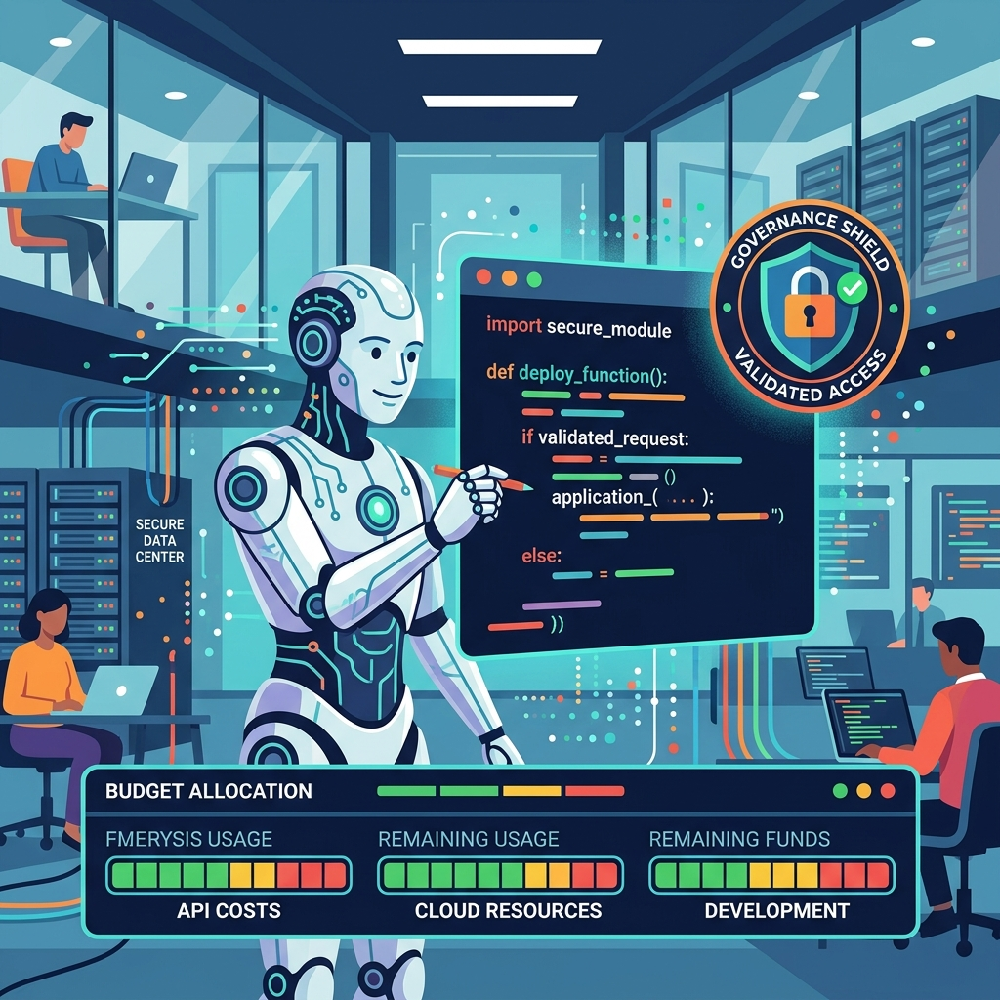

Google deja de vender Antigravity como experimento y lo pone sobre la mesa de los equipos de plataforma. Su agente de codificación, presentado en el I/O de mayo dentro de la **Gemini Enterprise Agent Platform**, ahora está **disponible de forma general en las suscripciones Gemini Enterprise**, con extensiones de IDE y una batería de controles de gobernanza pensados para que la adopción no sea un salto al vacío.

## La pelea que importa: el IDE y el bolsillo

Hasta ahora, sumar un agente de IA al flujo de un equipo grande significaba licencias separadas, consolas de billing distintas y poca visibilidad de quién gasta qué. Google lo empaqueta distinto: **Antigravity viene incluido en Gemini Enterprise**, con administración y control de gasto out-of-the-box en la consola de administración.

Los puntos que le van a importar a cualquier líder técnico:

- **Extensiones de IDE**: los devs usan Antigravity donde ya trabajan, empezando por **VS Code** (y Android Studio para los de móvil).
- **Topes de gasto granulares**: límites de presupuesto por proyecto, con controles por usuario y equipo que van llegando durante el año.
- **Cuotas agrupadas (pooled)**: un pozo de tokens compartido para que el equipo de alta demanda no deje cuota comprada muriendo sin uso en otra área.
- **Overages controlados**: si se revienta la cuota, el admin puede optar por overage con tope mensual, pasando el exceso a tarifa de consumo estándar.
- **Métricas de uso**: visibilidad centralizada de consumo de tokens, llamadas a la API y actividad de los devs.

## Gobernanza sin parches

Donde Antigravity se juega la entrada a la empresa es en seguridad y cumplimiento. Bajo Gemini Enterprise queda cubierto por las protecciones estándar de Google Cloud, con tres palancas concretas:

- **Políticas de seguridad configurables**: sandboxing del workspace y control de acceso al navegador y a servidores MCP, para que el agente opere solo dentro del perímetro autorizado.
- **Audit logging central**: con un toggle capturas prompts, respuestas del agente y metadatos para compliance.
- **Privacidad de datos**: toda la actividad corre dentro del límite de la nube del cliente, bajo los términos de servicio de Google Cloud.

## Por qué importa

Esto es parte de una tendencia clara: **los agentes de codificación dejaron de ser juguetes de dev individual y se están convirtiendo en infraestructura de equipo**, con la misma discusión de gobernanza, presupuesto y auditoría que un cluster Kubernetes o una cuenta de nube. Google no solo mete a Antigravity en la suscripción enterprise, sino que lo amarra a los controles que TI necesita para decir "sí" sin sudar.

Para los que ya andan evaluando agentes de código a escala, el mensaje es directo: la decisión ya no es solo "qué modelo escribe mejor", sino **quién te deja gobernarlo sin armar una torre de integraciones por tu cuenta**.

Fuente: Google Cloud Blog (Expanding Google Antigravity for enterprise customers).
