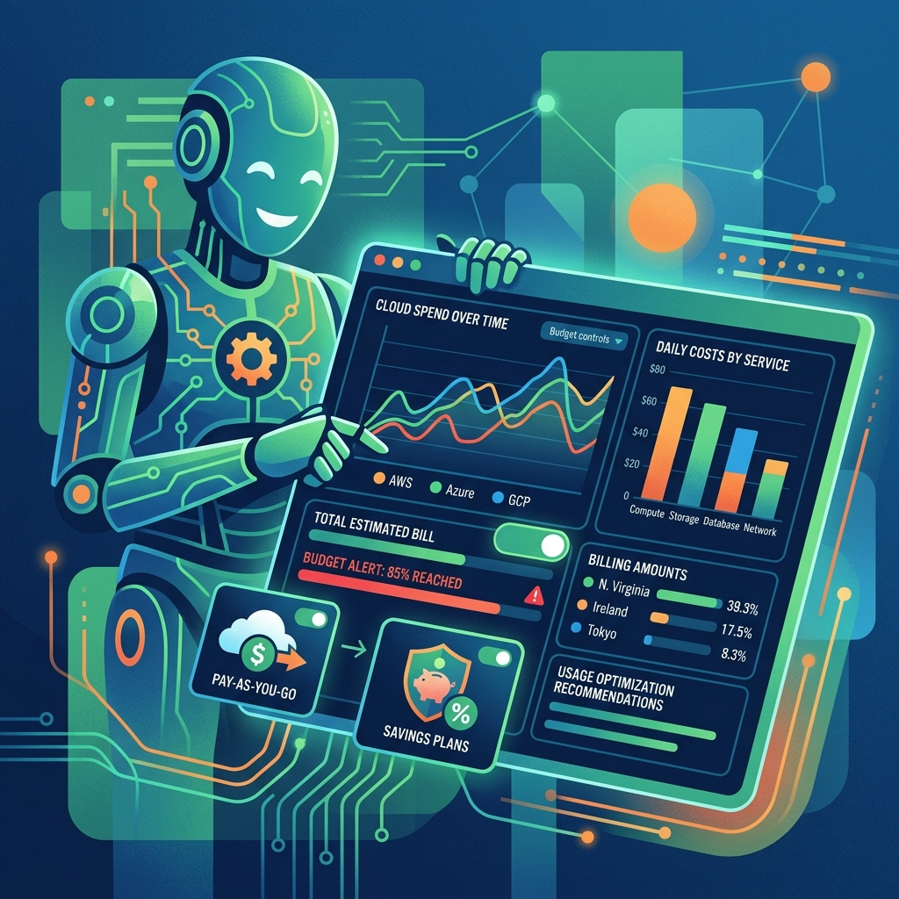

Cuando los agentes de IA pasan de demo a producción, el problema deja de ser "¿funciona?" y pasa a ser "¿cuánto me está saliendo y cómo lo controlo?". Google Cloud salió a responder eso mismo: anunció **billing flexible y nuevas herramientas de control de costos** para workloads de agentes, apuntando directo a la brecha entre innovar rápido con IA y proteger el margen.

## Lo que cambia en la práctica

- **Pay-as-you-go para Gemini Enterprise**: puedes mezclar las suscripciones por usuario (seat) de siempre con una nueva opción de pago por uso en la app de Gemini Enterprise. La gracia: correr workloads de agentes **sin chocar con los límites de cuota a mitad de tarea**.
- **Una sola vista para todo**: el uso de Google Antigravity, Android Studio AI y la plataforma se consolida en un único lugar, en vez de licencias y silos de billing separados. Antigravity y Android Studio AI ahora entran dentro de la suscripción de Gemini Enterprise (disponible para clientes selectos, con rollout amplio próximamente).
- **Savings Plans flexibles**: si tus cargas de IA son estables o van al alza, pagas menos a medida que crece el uso, con descuentos por uso comprometido.

## Por qué importa

La señal de fondo es clara: el costo de los agentes dejó de ser un detalle de backoffice y se convirtió en parte del producto. FinOps, que antes era cosa de equipos de infraestructura, ahora es un requisito del stack de IA. Google apuesta a que el control de costos — no solo el rendimiento del modelo — sea el argumento de venta para que las empresas se animen a escalar agentes en producción.

El mensaje para los equipos de platform engineering es directo: si vas a operar agentes, necesitas visibilidad de costo desde el día uno, no cuando llegue la factura.
