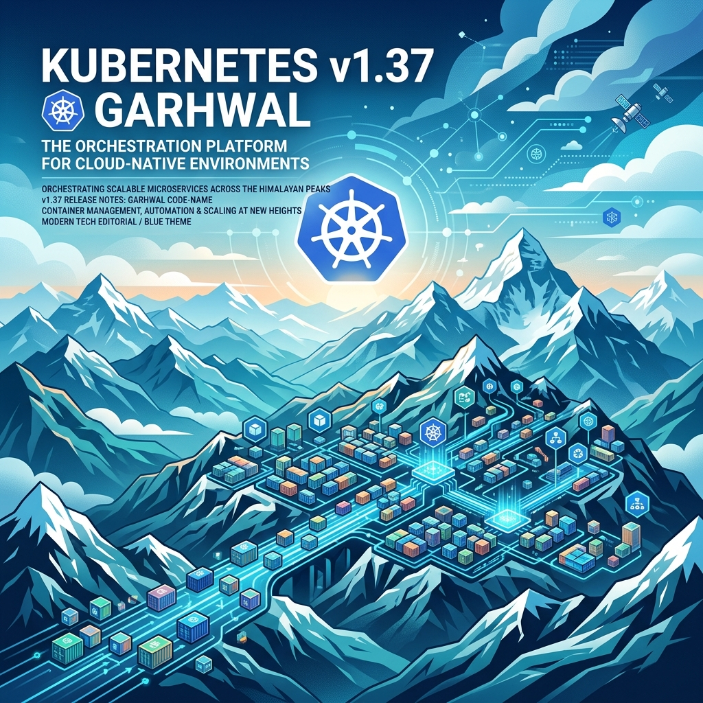

Se acabó la espera: hoy aterrizó **Kubernetes v1.37**, bautizado **"Garhwal"** en honor a una región del Himalaya en Uttarakhand, India. La movida viene con **67 mejoras**: 16 graduadas a Stable, 23 a Beta, 27 entrando como Alpha y 1 deprecación. Nada de humo, es un release denso con varias cosas que le cambian la vida a los que operan clusters grandes.

## Lo que de verdad importa

**HPA scale-to-zero ahora es Beta (y activo por defecto).** Esta es la estrella del release. Desde v1.16 estaba ahí medio escondido, y ahora el HorizontalPodAutoscaler puede bajar workloads a **cero Pods** cuando están ociosos y revivirlos cuando vuelve la demanda. La gracia está en los workloads con métricas *object* o *external* (colas, batch jobs, workloads de GPU): configuras `spec.minReplicas: 0` y listo. Ojo, **no funciona con métricas de CPU/memoria** (esas dependen de Pods activos, no hay magia). Mientras el HPA mantiene algo en cero, deja una condición `ScaledToZero: True` en el status, que le sirve para distinguir "lo apagué yo por ocio" de "alguien lo mató a mano".

**Watchcache resiliente completado.** El API server ya no se cae intentando calentar su cache: la inicialización/reinicialización de watchcache dejó de generar picos de tráfico contra etcd. Ahora kube-apiserver delega requests acotados y rechaza el resto con **HTTP 429 Too Many Requests**. Traducción: menos outages de control plane en clusters grandes. Eso sí, si mantienes controllers u operators propios, asegúrate de que manejen el 429 respetando `Retry-After` y backoff exponencial, porque ahora es parte del contrato.

**Admission control por manifiestos (Beta).** Los webhooks y políticas CEL ahora pueden cargarse desde archivos en disco (`staticManifestsDir` en `AdmissionConfiguration`) en vez de vivir solo en la API. Ventaja: se aplican desde el arranque del API server, siguen funcionando con etcd caído y pueden proteger los propios recursos de admission de ser modificados.

**Checkpoint/restore a nivel de Pod (Alpha).** El CRI suma RPCs `CheckpointPod` y `RestorePod` para que kubelet y los runtimes creen checkpoints de un Pod y lo restauren. Alpha puro por ahora (tu runtime tiene que implementar los RPCs), pero apunta a un futuro interesante para migración y recuperación.

## KYAML llega a Stable

KYAML (un subconjunto más seguro y menos ambiguo de YAML pensado para Kubernetes) se graduó a **Stable**, y `kubectl get -o kyaml` quedó estable. Cada archivo KYAML es YAML válido, así que no rompe nada de lo que ya tienes: tus manifiestos, tooling y pipelines siguen igual. Es una mejora de ergonomía más que una migración obligada.

## El tema

Garhwal es la región de los picos nevados, bosques de deodar y campos en terrazas del Himalaya indio. El logo es una "ventana" a ese paisaje, y el equipo de release hace el paralelismo obvio: cada nivel de terraza sostiene al siguiente, igual que cada release se apoya en el trabajo heredado. El detalle nerd: la casa del logo lleva "१.३७" (1.37 en numerales devanagari).

## Qué hacer

Si corres clusters: revisa si el watchcache endurecido te obliga a tocar tus controllers para manejar 429, y dale una mirada al HPA scale-to-zero si tienes workloads de cola o GPU que pagan tiempo muerto. El upgrade a v1.37 es la tarea de la semana para los que están cerca de EOL en versiones viejas.

Fuente: anuncio oficial de Kubernetes v1.37 en kubernetes.io/blog (26-08-2026).

### Update: 27-08-2026 — Metrics API se graduó a estable (metrics.k8s.io/v1)

Un día después del release, SIG Instrumentation confirmó otra de las graduaciones de v1.37: la **Resource Metrics API** (`metrics.k8s.io`) pasó de `v1beta1` a **estable (`v1`)**. Es la API detrás de `kubectl top` y del autoscaling basado en métricas de recursos.

Lo importante: **la superficie de la API es idéntica a v1beta1**. No hay campos renombrados ni cambios en el significado de los valores de CPU/memoria; es una graduación de versión, no un cambio en qué se recolecta. Expone dos tipos de recursos —`NodeMetrics` (CPU/memoria de un nodo) y `PodMetrics` (CPU/memoria por Pod, con desglose por contenedor)— y sigue siendo una API acotada a propósito: no reemplaza un pipeline de monitoreo completo ni la API de custom metrics (`custom.metrics.k8s.io`).

Detalles operativos que conviene tener en cuenta:

- **`kubectl top` soporta ambas versiones**: prefiere `v1` cuando está disponible y hace fallback automático a `v1beta1` en clusters que todavía no la sirven.
- **El HPA sigue usando solo `v1beta1`** por ahora. El soporte para selección por discovery entre `v1` y `v1beta1` está planificado, pero no llega en v1.37.
- No hay feature gate que habilitar: la API se sirve a través de la capa de agregación, por una implementación como **metrics-server**. Para que `v1` esté disponible en tu cluster, tu implementación debe servir `v1.metrics.k8s.io` y registrar el `APIService` correspondiente. Durante la transición, las implementaciones deberían servir `v1` y `v1beta1` en paralelo para no romper clientes viejos.
- `v1beta1` sigue disponible en v1.37, así que no hay apuro en migrar.

Para revisar qué versiones sirve tu cluster: `kubectl get --raw /apis/metrics.k8s.io/ | jq .`

Fuente: [kubernetes.io/blog](https://kubernetes.io/blog/2026/08/27/kubernetes-v1-37-metrics-api-ga/) (27-08-2026).
