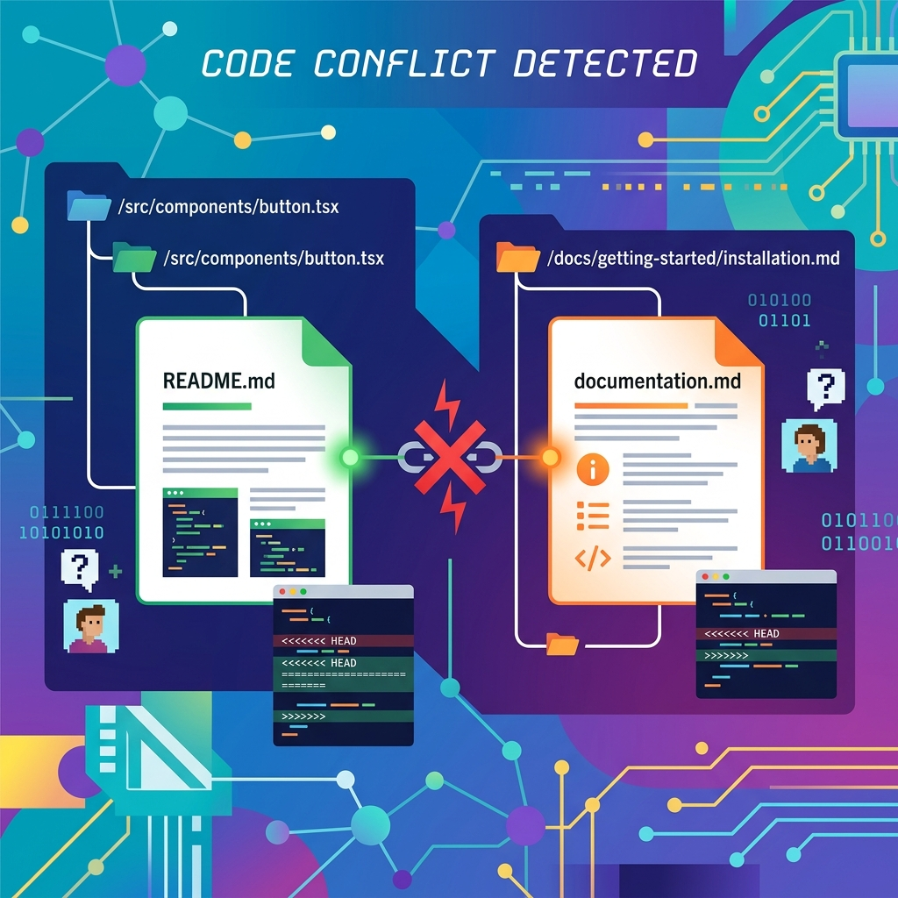

Drama de martes en el ecosistema dev: **Tobi Lütke, CEO de Shopify, amenazó con banear Claude Code** en toda la empresa. Y no es porque el agente de código de Anthropic sea malo — de hecho Lütke reconoce que es bueno — sino por un archivo Markdown.

> "Estoy pensando en banear Claude Code en Shopify hasta que cambien de opinión y lean AGENTS.md y .agents/skills etc. Insistir en leer solo CLAUDE.md a veces lleva a problemas de split-brain cuando distintos miembros del equipo usan herramientas distintas. Innecesario."

## El problema: split-brain en el monorepo

Shopify tiene miles de desarrolladores trabajando en un monorepo gigante, con agentes de código de distintos proveedores. Los archivos de instrucciones (CLAUDE.md, AGENTS.md) se aplican de forma recursiva por el árbol de directorios: cada subdirectorio puede traer su propio contexto para el agente.

Si un directorio tiene AGENTS.md pero no su equivalente en CLAUDE.md (o vice versa), los devs que usan Claude Code terminan trabajando con menos contexto que el resto. En palabras del propio Lütke: **"una parte de los devs trabaja con lobotomía"**. Shopify construyó automatización para sincronizar ambos archivos, pero su postura es clara: es un "impuesto de complejidad estúpido" que no deberían estar pagando.

## Dos estándares, un gancho

- **AGENTS.md**: nació en OpenAI en agosto 2025 como formato abierto de instrucciones por proyecto. Para diciembre ya lo usaban más de 60.000 proyectos open source, con soporte de Codex, Cursor, Gemini CLI, GitHub Copilot, Jules y VS Code. OpenAI lo entregó a la Agentic AI Foundation bajo la Linux Foundation.
- **CLAUDE.md**: el formato propio de Anthropic. Claude Code no lee AGENTS.md de forma nativa; ofrece workarounds (importar AGENTS.md desde CLAUDE.md o symlinks), pero en un repo grande hay que mantener todo sincronizado a mano o con automatización.

La cereza del postre: los desarrolladores llevan **casi un año pidiéndole a Anthropic soporte nativo para AGENTS.md** en GitHub, incluyendo un issue reciente por descubrimiento recursivo. Anthropic lo cerró como "not planned". De ahí el titular.

## Por qué esto no es una pelea de nicho

Un estudio de 2026 sobre 2.926 repositorios de GitHub ya mostró que los archivos de contexto son hoy la forma más común de darle instrucciones persistentes a los agentes de código. Con equipos usando varias herramientas en el mismo repo, que cada agente lea un estándar distinto significa reglas distintas para cada dev: justo lo que ningún platform team quiere mantener.

El takeaway es simple: **los archivos de instrucciones son infraestructura real**, no un detalle de config. Mientras no converja el estándar (o Anthropic ceda), los equipos multi-tool pagan el peaje en automatización y sincronización. Y si el CEO de Shopify está dispuesto a banear la herramienta más popular del momento por esto, es una señal de dónde está el dolor.

Fuentes: The New Stack (25-08-2026), X/@tobi, GitHub anthropics/claude-code issues #7060 y #69151.
