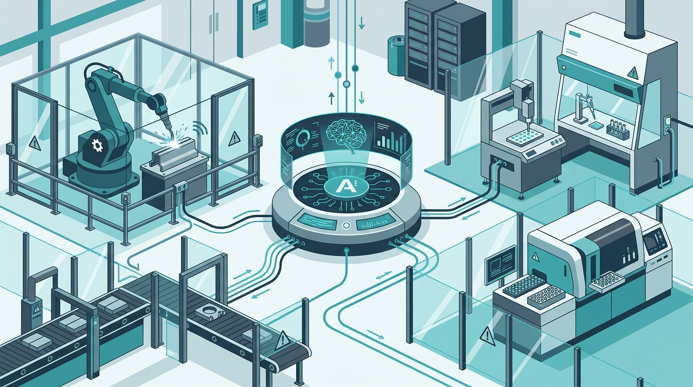

Anthropic abrió un **research preview del Model Hardware Standard (MHS)**, una especificación compartida para que los agentes de IA puedan **operar dispositivos físicos de forma segura**.

## De lo digital a lo físico

Hasta ahora los agentes de IA han vivido mayoritariamente en el mundo digital: llamadas a APIs, archivos, bases de datos, navegadores. El MHS apunta al siguiente salto: que un agente pueda interactuar con hardware del mundo real —máquinas, instrumentos, equipamiento de laboratorio o de manufactura— dentro de un marco estandarizado que priorice la seguridad.

## El primer grupo

La preview está abierta a un primer grupo de **laboratorios de investigación científica y fabricantes avanzados**. No es un lanzamiento masivo, sino una apertura controlada para validar la especificación en entornos reales antes de ampliarla.

## Por qué importa

Un estándar compartido para la interacción agente-hardware es la pieza que faltaba para que la IA deje de ser "un copiloto que escribe y razona" y empiece a "un operador que actúa sobre el mundo físico". Y ahí la seguridad no es un nice-to-have: es el requisito de entrada.

La jugada de Anthropic tiene lógica: definir el estándar antes que se convierta en un caos de integraciones propietarias, y posicionarse como la referencia para la IA que toca el mundo real.

Fuente: [Anthropic News](https://www.anthropic.com/news)
