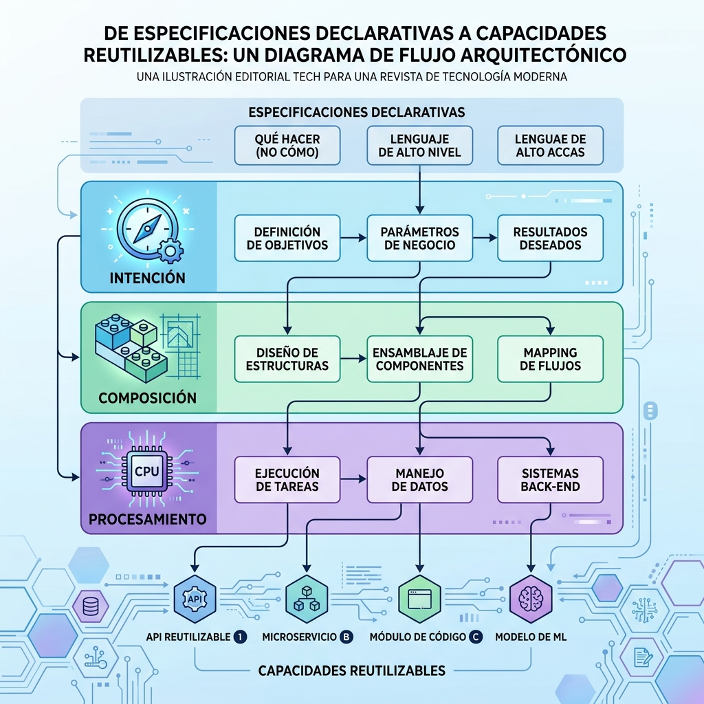

AWS publicó un patrón de arquitectura llamado **Specification Driven Composition** para construir data workflows flexibles. La idea central: **separar la intención del workflow de la lógica de procesamiento**, para no terminar duplicando código de pipeline cada vez que entra un dataset nuevo.

## El problema que ataca

Los pipelines basados en scripts suelen mezclar orquestación, transformación y validación en un solo lugar. Resultado: cada dataset nuevo implica cambios de código y redeploys, la duplicación se acumula y —lo peor en entornos regulados— el comportamiento del workflow se vuelve difícil de rastrear.

## Las tres capas

El patrón separa el workflow en:

1. **Capa de intención:** la especificación (típicamente JSON o YAML) que describe datasets de origen/destino, mapeos de campos y transformaciones, **sin** definir cómo se implementan.
2. **Capa de composición:** valida la especificación, chequea las capacidades referenciadas y arma el workflow ejecutable.
3. **Capa de procesamiento:** ejecuta los pasos de transformación.

Un **registro de capacidades** mantiene los metadatos de las funciones reutilizables: identificadores, formatos de entrada/salida, detalles de invocación, permisos y versiones.

## La implementación de referencia

En el ejemplo de AWS: las especificaciones viven en **S3**, un evento dispara un **Lambda** que actúa de compositor, valida la spec y consulta **OpenSearch** por los metadatos de capacidades, y arma un state machine de **Step Functions** que invoca los procesadores (Lambdas) que emiten trazas a CloudWatch Logs.

AWS afirma que este enfoque puede reducir el onboarding de datasets **de semanas a días**, manteniendo trazabilidad, versionamiento, clasificación de datos y gobernanza.

## Por qué importa

Es el clásico "declarativo sobre imperativo" pero aplicado a data engineering: en vez de escribir N pipelines, escribes specs y un motor de composición. Si ya te pasó que agregar una fuente nueva te costó un sprint, este patrón —aunque sea con tus propias piezas— vale la pena mirarlo.

Vía [InfoQ](https://www.infoq.com/news/2026/08/aws-spec-driven-data-workflow/).
