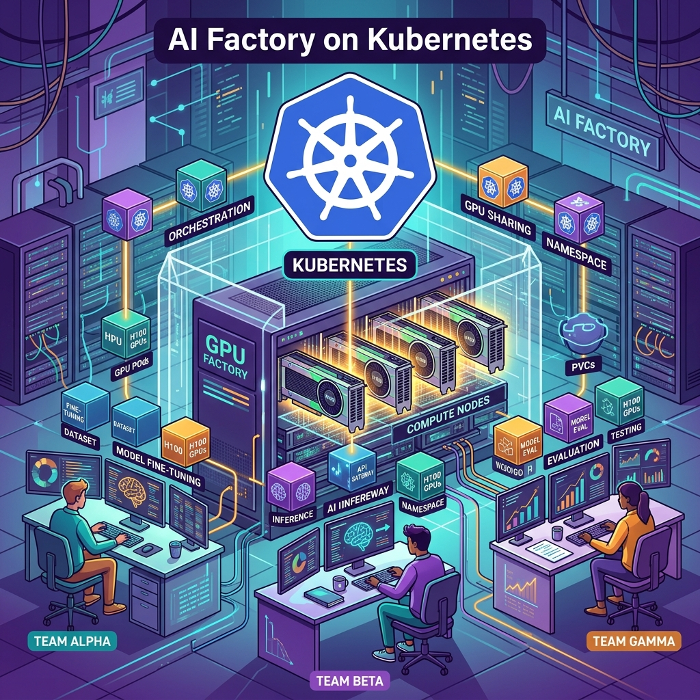

Si pensabas que el problema de la IA en producción era "servir modelos", Hrittik Roy (CNCF Ambassador y Platform Advocate en vCluster) te baja de la nube: **el verdadero dolor es la utilización de GPU**. En un post para el blog de CNCF, Roy desmenuza cómo armar una *AI factory* sobre Kubernetes —un pool de aceleradores que varios equipos usan a la vez: uno afinando, otro sirviendo inferencia y un tercero corriendo evaluaciones— sin que nadie pise a nadie.

## La GPU no es el problema, el wrapper sí

La tesis es directa. Hace dos años todos armaban su "developer platform"; Kubernetes ya tenía primitivas maduras (contenedores, RBAC, autoscaling, política), pero le faltaba una respuesta limpia para dos cosas: **aceleradores** y **aislamiento entre tenants sobre los mismos nodos**. Esa es justo la brecha que una AI factory debe cerrar.

El gasto de capital dominante son los aceleradores, y la métrica que decide si la inversión rinde es **utilización**, no un peak de tokens/segundo. Roy cita el [ClusterMAX](https://www.clustermax.ai/) de SemiAnalysis, que califica a los proveedores de GPU cloud por seguridad, red, storage, confiabilidad y soporte —y premia el aislamiento duro por tenant (hasta clústeres de Kubernetes por tenant y aislamiento basado en DPU), castigando los límites débiles.

## Los dos asesinos de la utilización

1. **El modelo de recursos:** con el device-plugin tradicional, pedir `nvidia.com/gpu: 1` clava una GPU completa aunque la uses al 10%. **Dynamic Resource Allocation (DRA)**, GA en Kubernetes 1.34, deja que el scheduler trate los aceleradores como dispositivos ricos con atributos, memoria y topología. Ojo: DRA no particiona la GPU por sí solo; la densidad viene de la capa de dispositivo de abajo (MIG, HAMi, time-slicing).

2. **El modelo de aislamiento:** para mantener equipos separados, lo seguro es un clúster (o un bloque de GPUs) dedicado por equipo. Seguro, sí —pero desperdicia la mayoría del hardware.

## La receta, capa por capa

Roy la plantea como un problema de ensamblaje, y casi todas las piezas son nativas de Kubernetes o proyectos CNCF:

- **Ciclo de vida del hardware:** Metal3 / Ironic, Tinkerbell, Redfish, NetBox.
- **Ciclo de vida del clúster:** Cluster API + Argo CD o Flux (GitOps).
- **Inventario de nodos:** Node Feature Discovery, GPU/Network Operator (NVIDIA, AMD).
- **Aislamiento de tenants:** clústeres por tenant (vCluster) y runtimes con sandbox.
- **Asignación de GPU:** DRA, MIG, HAMi, time-slicing; schedulers como KAI Scheduler (topology-aware), Volcano y Kueue.
- **Inferencia y serving:** vLLM, KServe, llm-d.
- **Batch / HPC:** Slinky (SLURM sobre Kubernetes).
- **VMs:** KubeVirt.

## El takeaway

La conclusión no es "adopta un modelo server nuevo", sino armar un stack que **asigne aceleradores sin dejar capacidad varada ni insegura**, y que aisle tenants para que empaquetarlos juntos de verdad aguante. Si estás armando tu propio pool de GPUs compartido, este post es un buen mapa de ruta de por dónde empezar.
