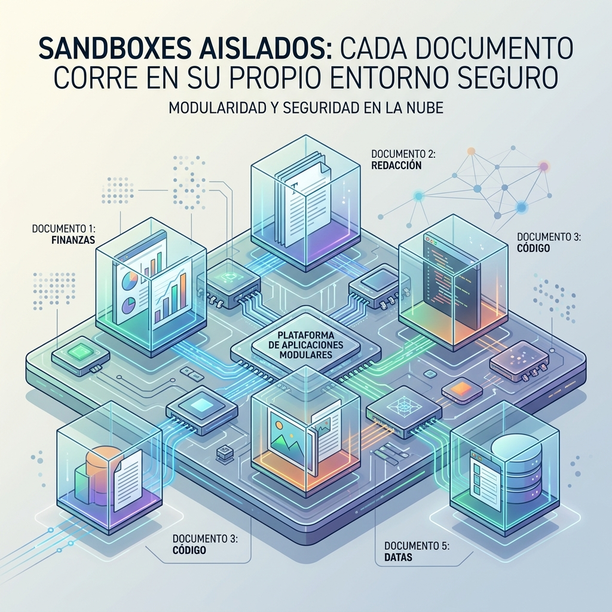

Cloudflare liberó **Cloudflare OS** en GitHub: una plataforma de IA corporativa construida sobre un **modelo basado en capacidades (capability-based)**. La premisa, en palabras de su arquitecto principal Kenton Varda, es medio provocadora:

> "Hoy lanzamos Cloudflare OS, un chatbot con conectores, igual que todas las tech companies... excepto que en realidad es distinto."

## La idea: un "Gadget" por documento

El diferencial está en el modelo de sandboxing. En vez de una app SaaS compartida, **cada documento (o "Gadget") corre como una instancia separada de la app, en su propio sandbox**. Eso tiene dos consecuencias grandes según Varda:

1. **Control de acceso centralizado:** la plataforma controla quién accede a cada Gadget. Un Gadget no puede "filtrarse" a un atacante solo porque ese atacante accede a otros Gadgets de la misma app.
2. **Cada uno puede modificar su copia:** si todos corren su propia copia del código, pedirle al agente "agrégame esta feature" se vuelve viable —algo que el modelo SaaS clásico no permite.

En resumen: una plataforma donde un usuario no técnico puede "vibee-code" su app, y el equipo de seguridad duerme tranquilo. O al menos esa es la promesa.

## De dónde salió

No es un invento de laboratorio: nació del propio dolor de escalamiento de Cloudflare. Su CIO, Sam Rhea, había reportado que los empleados buscaban desplegar **workflows de IA generativa no auditados** a toda velocidad para crear "SuperApps" propias. Cloudflare OS es la respuesta a ese caos: darles la plataforma segura para hacerlo en vez de que lo hagan por la puerta de atrás.

## Por qué importa

Esto toca un tema que el blog viene siguiendo: **cómo gobernar la IA "ciudadana" dentro de la empresa**. Mientras Microsoft propone enforcement en runtime y agentes con permisos, Cloudflare apuesta por aislar la ejecución a nivel de sandbox por documento. Dos filosofías distintas para el mismo problema: dejar que la gente construya sin que el caos se coma el compliance.

Vía [InfoQ](https://www.infoq.com/news/2026/08/cloudflare-os-ai-platform-secure/).
