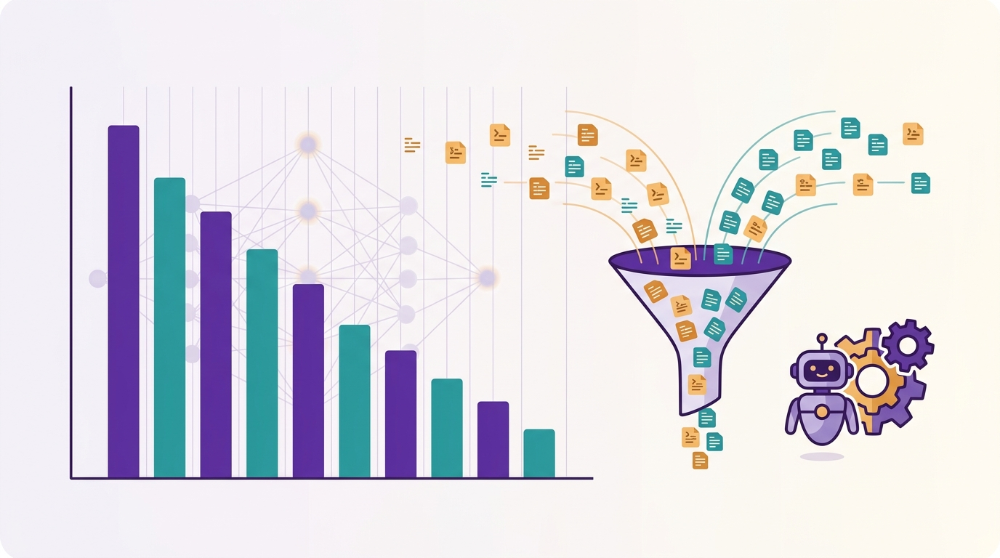

Si tu equipo ya usa agentes de IA para codear, sabes que el gasto en tokens se dispara rápido. Datadog lo vivió en carne propia y publicó un post contando cómo su equipo de plataforma recorta **más de $1 millón al mes** en gasto de IA sin sacrificar rendimiento. La receta combina FinOps aplicado a modelos, evaluaciones de agentes y optimización de contexto.

## La idea: tunear la IA como se "rightsizea" la nube

El argumento es directo: así como ajustas el tamaño de una instancia, puedes afinar la configuración de las herramientas de IA —tipo de modelo, familia modal y nivel de esfuerzo— para bajar costos sin romper nada. Para eso primero necesitas **saber exactamente en qué se te va la plata**.

Datadog usa su propia feature **AI Costs** dentro de Cloud Cost Management, que normaliza tags por proveedor, modelo y categoría de token. Todo request de Claude Code pasa por un AI gateway que lo etiqueta con su equipo o producto, así pueden mapear el gasto de Anthropic, Cursor y OpenAI hasta el nivel de workflow individual.

## Los tres mandos

El post desglosa tres palancas:

- **Tipo de modelo**: cambiar de un modelo caro a uno más barato cuando la tarea no lo amerita.
- **Familia modal**: elegir entre modalidades (texto, reasoning, etc.) según lo que realmente necesitas.
- **Nivel de esfuerzo**: ajustar cuánto "piensa" el modelo antes de responder.

Lo clave es que **ningún cambio se manda a producción a ciegas**: corren evaluaciones de agentes a diario para medir el trade-off costo/rendimiento antes y después.

## Headroom: comprimir contexto y el número que más duele

El plato fuerte es la optimización de contexto. Cuando un agente lee miles de líneas para responder algo simple, se quema plata en tokens que no aportan. Datadog probó [Headroom](https://github.com/headroomlabs-ai/headroom), una tool open source que filtra, deduplica y comprime la data que las herramientas le pasan al LLM.

Los resultados de sus propias evaluaciones:

- **47% de reducción de costo** sin caída significativa de rendimiento en evals.
- En un A/B test con más de **1.000 ingenieros**, el costo por usuario cayó **27%**.
- Tokens de entrada por usuario: **-39,3%**. Tokens de salida: **-35,7%**.

Con eso, planean desplegar Headroom a grupos cada vez más grandes de ingenieros mientras siguen explorando más opciones de ahorro.

## Por qué importa

Esto deja una señal clara para el rubro: **FinOps ya no es solo de infraestructura, también es de modelos**. La combinación de observabilidad de costos + evaluaciones de agentes + optimización de contexto se está volviendo el estándar para no quemar presupuesto en IA. Si tu organización está escalando coding agents, vale la pena mirar cómo mapeas y etiquetas ese gasto antes de que la cuenta llegue.
