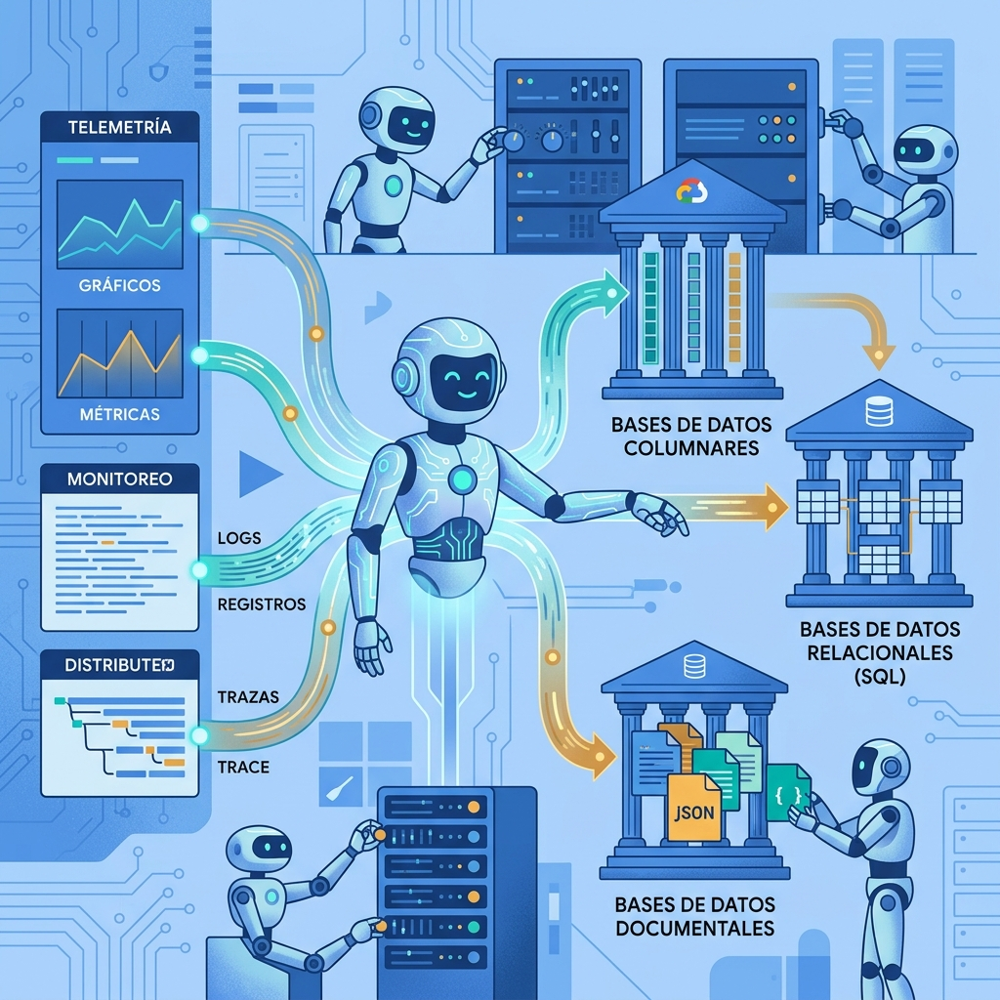

Google Cloud sigue empujando su apuesta por los agentes, ahora apuntando a un terreno que históricamente da más dolores de cabeza de lo que admite: **el ciclo de vida de las bases de datos**. Los nuevos **Database Operations Agents** llegan con dos frentes —un *Onboarding Agent* y un *Observability Agent*—, ambos integrados con **Gemini Cloud Assist** y disponibles para Cloud SQL, Spanner, AlloyDB, Firestore, Memorystore y Bigtable.

## Onboarding: de "¿qué base uso?" a comandos listos

El **Database Onboarding Agent** apunta a developers. Describes tus requerimientos en lenguaje natural y el agente entiende métricas técnicas como IOPS, límites de latencia y replication lag, para recomendarte la base más adecuada según carga, performance, escala, tipo de dato y confiabilidad. No se queda en la sugerencia: **valida la recomendación contra tus requerimientos** y genera los comandos para provisionar, configurar y desplegar la instancia.

## Observabilidad: root cause en minutos, no en horas

El **Observability Agent** va para SRE y DevOps. Cuando la operación escala, detectar problemas sutiles como *query hotspots* o *lock contention* se vuelve caro. La propuesta es usar la expertise operacional de Google + el razonamiento de Gemini para conectar telemetría de forma automática entre **Database Insights, Cloud Monitoring, Cloud Logging y Cloud Trace**, y entregar un análisis de root cause claro en minutos. Además permite construir resúmenes por flota, correlacionar fuentes y **ejecutar remediaciones** (con aprobación del ingeniero).

## Sin dashboard nuevo que aprender

Un punto a favor: no te obligan a adoptar una consola especializada. Las capacidades viven donde ya trabajas —el chat de Gemini/Cloud Assist, la consola de Google Cloud, CLI e IDEs como **Antigravity**—, y las mismas métricas (sistema, queries, inventario de flota e issues detectados) también se exponen vía **servidores MCP**, para integrarlas a tu flujo actual.

En corto: dos agentes que atacan el dolor clásico de "montar y mantener bases" con la fórmula que Google ya viene aplicando en el resto de su portafolio —agentes + Gemini + MCP—. Si tu equipo está sobre AlloyDB, Spanner o Bigtable, vale la pena probarlos.
