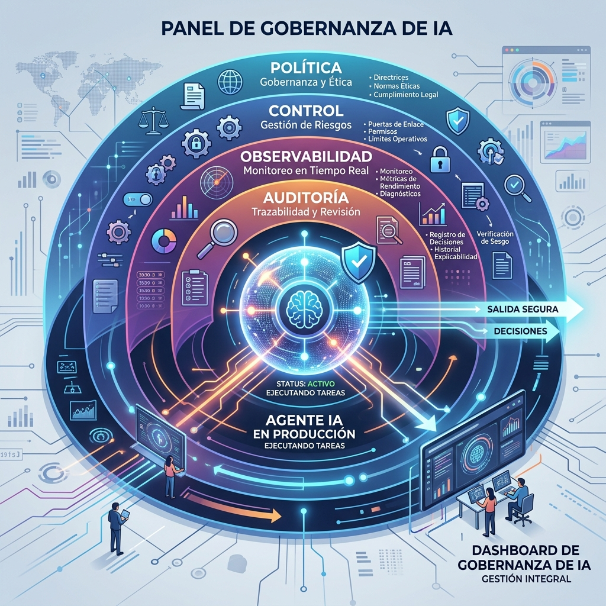

Microsoft publicó una **arquitectura de gobernanza de IA** que apunta a un cambio de fondo: dejar de tratar la gobernanza como un documento y convertirla en **enforcement en runtime**, evaluación continua, observabilidad y evidencia de auditoría. El momento no es casual: las empresas están poniendo agentes en producción y se están topando con que "cumplir" ya no es solo tener una política escrita.

## El loop operacional

La arquitectura se organiza en **nueve dominios** (política, gobernanza de datos, gobernanza de modelos, observabilidad, evaluaciones, seguridad, identidad y acceso, auditoría y cumplimiento, y gobernanza de agentes) y **cuatro funciones**:

- **Política:** establece requisitos y clasificaciones de riesgo.
- **Control:** traduce esas políticas a reglas de acceso y runtime.
- **Visibilidad:** la observabilidad captura el comportamiento real del sistema.
- **Prueba:** los procesos de auditoría convierten la telemetría operacional en evidencia para cumplimiento e investigación de incidentes.

La idea es un ciclo continuo, no una checklist de una vez.

## Cómo se arma en Azure

La arquitectura combina **Microsoft Foundry** con Purview, Entra ID, Defender y Azure API Management. El punto clave es el **AI Gateway de Foundry**, que actúa como frontera de runtime para autenticación, límites de tokens, cuotas y enforcement de políticas.

Un detalle interesante para los que viven en el mundo MCP: Microsoft documenta usar ese gateway para **gobernar herramientas MCP** —autenticación centralizada, rate limiting, restricciones por IP y audit logging— **sin tocar los servidores MCP ni el código del agente**.

## La frase que resume todo

Manasa Ramalinga, cloud solution architect de Microsoft, lo dijo simple:

> "Las organizaciones no pueden escalar lo que no pueden controlar."

## Por qué importa

Esto junta dos temas que antes iban separados: **gobernanza + observabilidad**. La promesa es que el mismo gateway que limita tokens y cuotas te dé la evidencia de que "lo que dices que haces" es "lo que realmente pasa". Para equipos de platform engineering que están lidiando con agentes en producción, es un blueprint interesante para copiar —aunque sea con herramientas open source.

Vía [InfoQ](https://www.infoq.com/news/2026/08/microsoft-ai-governance/).
