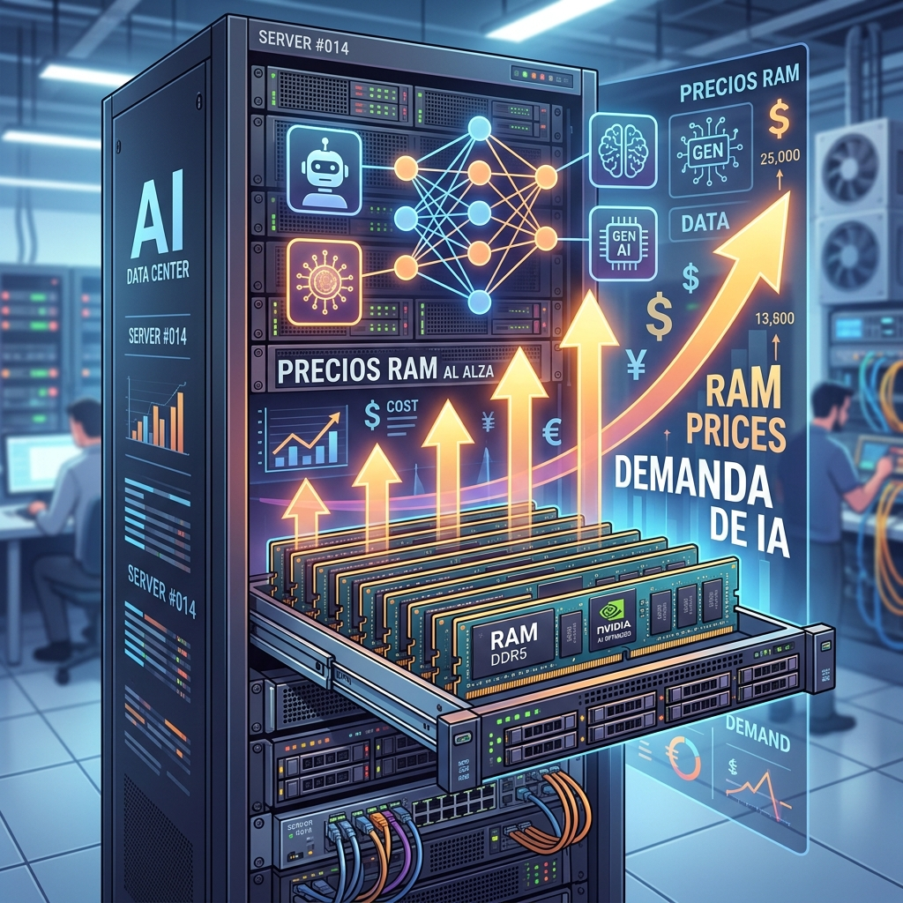

Si pensabas que la fiebre de la IA solo encarecía las GPUs, mala noticia: ahora está golpeando hasta los servidores "aburridos". OVHcloud confirmó que **subirá precios en la mayoría de su catálogo este otoño**, y el motivo no está en sus productos, sino en la cadena de suministro que la IA se está comiendo.

## Los números que duelen

Octave Klaba, fundador de OVHcloud, lo explicó sin vueltas en X. Indexando a junio de 2025 como base 100:

- **RAM:** 604 en junio 2026 (o sea, **6x más cara** que un año antes). Y pronostica **x9 en septiembre** y hasta **x12 a inicios de 2027**.
- **SSD:** 323 (3,2x).
- **Discos duros:** 148 (1,5x).

El mecanismo es simple y brutal: los tres grandes fabricantes de RAM reconfiguraron sus plantas hacia **memoria de alto ancho de banda (HBM)** para GPUs, que deja mejor margen, sacrificando la DDR4/DDR5 estándar con la que se arma cualquier servidor de la vida.

## Quién paga más

El golpe es desigual según lo nuevo que sea tu equipo:

- Servidores gaming edición 2026: **+87%**.
- Otros servidores recientes: **+40% a +59%**, desde septiembre.
- Equipos 2024: suben menos al renovar (3 a 6 veces menos que un pedido nuevo).
- Gamas viejas (Kimsufi, Rise, etc.): intactas, como ya pasó en el alza de abril.

Además, desde el 1 de octubre el almacenamiento y las IP pasan a cobrarse como ítems separados en instancias Gen3.

## "Durará hasta 2028"

Klaba fue directo sobre cuánto va a durar esto:

> "La situación es excepcional y durará hasta 2028. La demanda de IA es una locura en todos los niveles: datacenters, GPUs, token-as-a-service, IA agéntica."

Y también fue honesto sobre por qué no absorben el costo: *"El principal problema que queremos evitar es quedarnos sin partes y no poder entregarles el Cloud."*

## Por qué importa

Esto deja de ser una nota de precios de un proveedor: es la señal de que **el boom de la IA está repreciando la infraestructura no-IA**. Si tu presupuesto de cloud asumía que RAM y disco bajarían con el tiempo, revisa tus números. La memoria para "todo lo demás" entró en competencia directa con las GPUs, y por ahora van perdiendo.

Vía [InfoQ](https://www.infoq.com/news/2026/08/ovhcloud-memory-price-rise/).
