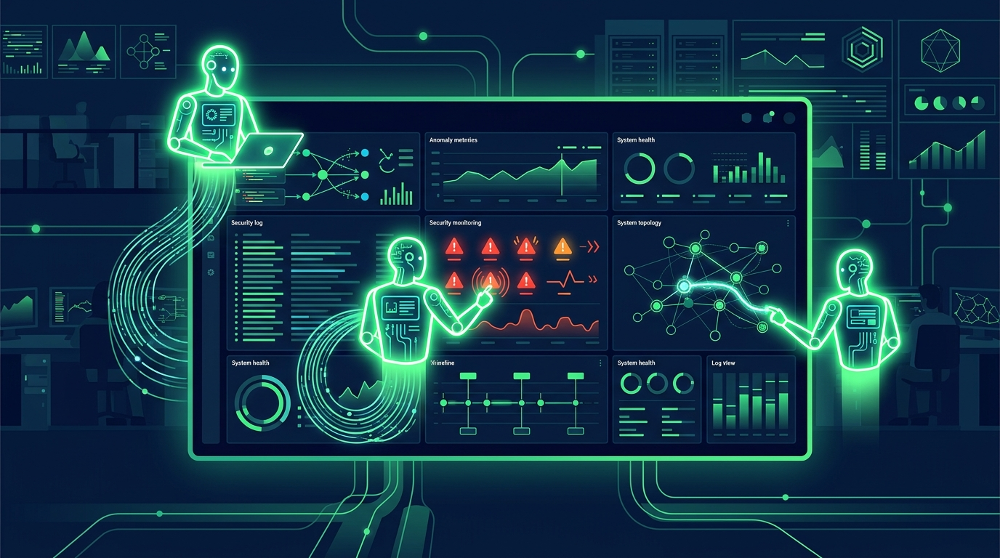

Splunk anunció la **disponibilidad general de Agent Launchpad**, una forma **no-code** de construir agentes de IA dentro del entorno Splunk, usando los permisos (RBAC) que ya tienes.

## El problema que ataca

Splunk ya te dice cuándo pasa algo: una alerta se dispara, una búsqueda programada marca una anomalía, una detección levanta actividad sospechosa. El problema es lo que viene después: investigar esa señal normalmente implica pivotar entre tickets, chat, runbooks, bases de conocimiento, consolas cloud, sistemas de identidad y herramientas de threat intelligence. Cada pivote cuesta tiempo, y el resultado depende de quién sepa dónde mirar.

Ese gap entre **señal y acción** es donde se estancan las investigaciones.

## Qué trae Agent Launchpad

Los agentes se construyen sin escribir código y **se lanzan directamente desde búsquedas y alertas**, llegando con el contexto necesario para razonar y actuar. Puntos clave:

- **No necesitas un data scientist** ni especialista en IA: si eres SME de IT, Seguridad o Redes y conoces el workflow, puedes armar tu agente.
- Los **admins controlan** las herramientas aprobadas y el acceso.
- Cada acción del agente queda **revisable**, con evidencia, antes de decidir qué hacer.

## El contexto

Agent Launchpad es parte del **Splunk AI Toolkit** y del **Cisco Data Fabric** impulsado por la Plataforma Splunk. Viene a cerrar el círculo que abrió el MCP server de Splunk hace un año: antes había que construir el agente fuera de la plataforma (modelo, harness, conexiones); ahora se construye dentro, sobre tus datos y tus permisos.

La promesa es concreta: que las ideas de automatización que hoy mueren atascadas en el backlog de ingeniería puedan activarse desde el mismo flujo donde aparece la señal.

Fuente: [Splunk Blog](https://www.splunk.com/en_us/blog/artificial-intelligence/introducing-splunk-agent-launchpad.html)
