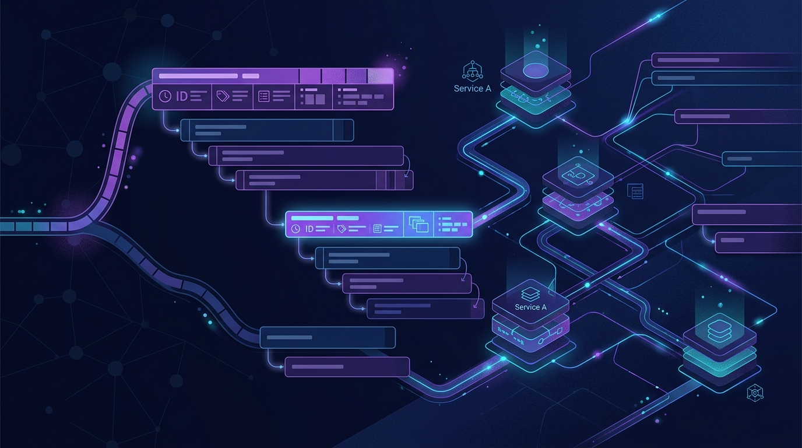

Detrás del ida y vuelta con un LLM hay un montón de trabajo invisible: recuperar contexto, llamar modelos, generar respuesta. Los **spans** son lo que hace visible ese trabajo, no solo en aplicaciones de IA, sino en cualquier sistema distribuido. Dynatrace publicó la segunda parte de su serie de OpenTelemetry desmenuzando qué hay adentro de un span — y es de esas guías que conviene tener a mano cuando un trace te mira de vuelta sin decir nada.

## Los 10 bloques de todo span

Un span es un registro estructurado. Da igual si trackea un HTTP call, una query a la base o un prompt a un LLM: siempre lleva la misma anatomía. Dynatrace lo compara con una molécula de ADN — las mismas bases, ordenadas distinto.

1. **Span context — la cédula de identidad.** Es la identidad inmutable que se propaga entre servicios. Cuatro campos: `trace_id` (128-bit, compartido por todo el request), `span_id` (64-bit, único del span), `trace_flags` (bitmask de sampling) y `trace_state` (metadata vendor-specific de propagación).
2. **Span name — la etiqueta legible.** Corto y de baja cardinalidad: `GET /users/{id}`, no `GET /users/12345`. Los IDs y emails van a Attributes, jamás al nombre.
3. **Span kind — el rol.** Server, client, producer, consumer, internal. Define de qué lado del límite de servicio estás.
4. **Timespan y duration — el timing.** Start + end. Es lo que arma la cascada del trace.
5. **Span status — ¿salió bien?** Unset, ok o error. La señal mínima de salud.
6. **Attributes — el contexto rico.** Pares clave-valor: `http.method`, `db.statement`, `gen_ai.prompt`. Es donde vive el detalle.
7. **Span events — hitos con timestamp.** Logs estructurados anclados en el tiempo dentro del span, para marcar hitos sin romper la estructura.
8. **Span links — la relación entre traces.** Para conectar spans que no comparten padre, como un job batch y la transacción que lo disparó.
9. **Resource — el "desde dónde".** A qué servicio, host o proceso pertenece el span.
10. **Instrumentation scope — quién lo emitió.** Qué librería o SDK generó la telemetría.

## La convención GenAI que ya importa

El detalle con más sabor para los que están instrumentando agentes: los nombres de spans para LLMs siguen una convención `{operación} {modelo}`. Ejemplos del post:

- `chat gpt-4o`
- `embeddings text-embedding-3-small`
- `execute_tool search_knowledge_base`

La idea es clara: nombre de operación como clase, no como instancia específica. Si cada llamada al modelo tuviera su propio nombre high-cardinality, el trace sería imposible de agrupar.

## El takeaway

La mayoría de la gente entra a los traces leyendo solo la cascada (nombre + duración). Pero cuando un span está lento o falla, los otros ocho bloques son los que tienen la respuesta: un attribute con el detalle del query, un event que marca dónde se colgó, un link a otro trace que explica el contexto. Conocer la anatomía es la diferencia entre mirar un trace y *leerlo*.

Fuente: [dynatrace.com/news/blog](https://www.dynatrace.com/news/blog/opentelemetry-series-anatomy-of-an-otel-span/) (28-08-2026).
