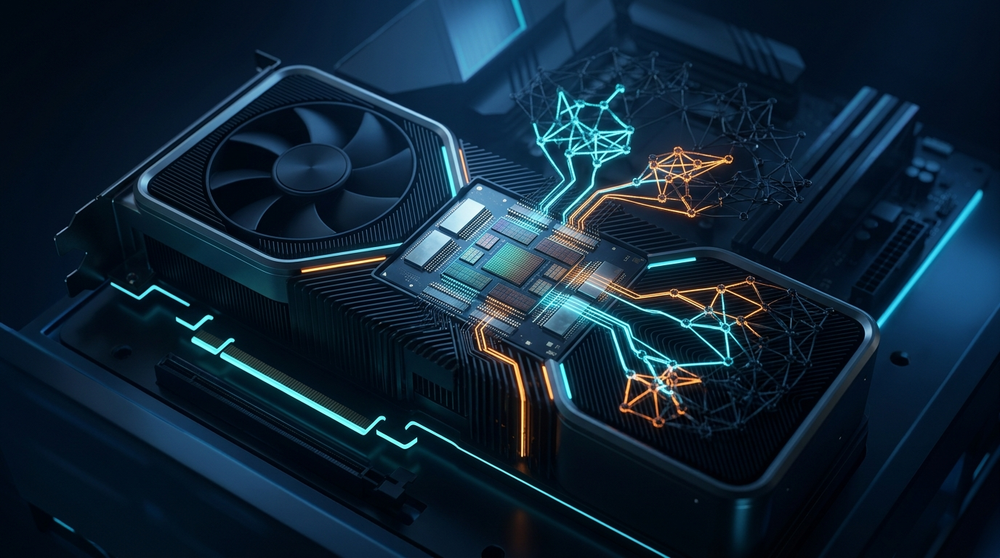

La promesa de correr un modelo frontier en tu tarjeta gráfica de escritorio se acerca un poco más. Investigadores de **UC Berkeley y MIT** presentaron **FreeToken**, un motor de inferencia open-source pensado para meter modelos **Mixture-of-Experts (MoE)** gigantes en hardware de consumidor. En el equipo están los cofundadores de Databricks **Matei Zaharia** e **Ion Stoica**, más **Song Han** y **Kurt Keutzer**.

## El problema de fondo

Los MoE dispersos solo computan una fracción de sus parámetros por token, pero en decodificación hay que enrutar sobre **cientos de miles de millones de pesos inactivos**. En datacenter, interconexiones de alto ancho de banda tipo NVLink esconden el costo de mover esos expertos. En hardware de consumo, el PCIe (16–64 GB/s) y la latencia de la RAM del host se convierten en un cuello de botella brutal. Los runtimes de borde actuales usan *offloading* estático: los pesos inactivos viven en RAM y se stremean sincrónicamente a la GPU al activarse, lo que **congela la ejecución en cada cache miss**.

## La jugada: política q*

FreeToken reemplaza el offloading rígido por una **co-programación dinámica** llamada *política q**: en vez de detener la GPU en los cache misses, **divide el cómputo del token entre núcleos de CPU y tensor cores de GPU** según el throughput real de la interconexión en ese momento. Suma un formato de pesos rápido (**FTW**) con double buffering de capa completa, para que el streaming de pesos por PCIe se solape por completo con las capas en cómputo activo. Y un gestor de memoria elástico que reasigna VRAM entre las entradas del KV cache y los slots de expertos residentes **sin recargar el modelo**.

## Pensado para agentes

Los asistentes de código y agentes autónomos tienen un patrón de ejecución muy particular: edits constantes de prompt, respuestas de tool-calls y bloques de "thinking" que cambian el contexto a cada rato. Los motores estándar descartan los KV cache lineales cuando el prefijo muta, gatillando recomputaciones caras. FreeToken integra **checkpointing de anclas semánticas**, cacheando estados de atención intermedios en límites lógicos de tarea. Si un agente edita un argumento o inyecta output externo, reusa los estados de sub-secuencia en vez de invalidar todo el prompt cache.

## Números que importan

- **Qwen3.6-35B** a ~**39 tokens/seg** en un laptop con RTX 4060 de 8GB.
- **DeepSeek-V4-Flash (284B)** servido en una RTX 5090 de escritorio.
- **GLM-5.2 (753B)** en una sola GPU de workstation.
- Contra Ollama/llama.cpp: **3–4x más rápido en decode** y **6–30x en prefill** en modelos MoE equivalentes.

El proyecto soporta GPUs NVIDIA RTX 30/40/50 en Linux y Windows, con CLI y cliente de escritorio disponibles en [FlashML.ai](https://www.flashml.ai/) y el [repo de GitHub](https://github.com/FlashML-org/FreeToken). El paper está en arXiv (`2608.16157`).

Fuente: [InfoQ](https://www.infoq.com/news/2026/08/freetoken-local-inference/) (28-08-2026).
