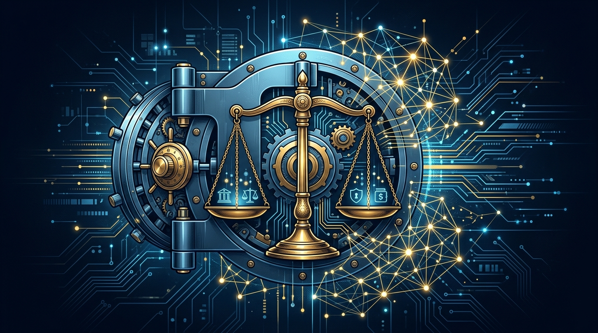

Google Cloud dejó de vender "Gemini para todos" y pasó a "Gemini para *tu* industria". Esta semana presentó **Gemini Enterprise for Legal** y **Gemini Enterprise for Financial Services**, las dos primeras piezas de lo que describen como una **nueva suite de soluciones por industria**. El anuncio viene firmado por **Thomas Kurian**, el CEO de Google Cloud, y marca un giro claro: competir en los verticales regulados con IA hecha a la medida del compliance de cada sector.

## Qué trae la suite

- **Gemini Enterprise for Legal**: orientado a despachos y equipos legales internos — revisión de contratos, análisis de jurisprudencia, redacción y gestión documental, con el foco puesto en trazabilidad y confidencialidad.
- **Gemini Enterprise for Financial Services**: para banca, seguros y fintech, con énfasis en análisis de riesgo, cumplimiento normativo y atención de clientes dentro de los marcos regulatorios del rubro.
- Ambos son **soluciones "purpose-built"**: no un LLM genérico con un prompt bonito, sino ofertas empaquetadas con integraciones, flujos y controles pensados para cada industria.

## Por qué importa

El mensaje de fondo es que **la carrera enterprise se gana por vertical**. Los sectores más lucrativos (legal, banca, salud) son justamente los que más fricción regulatoria tienen: no les sirve cualquier modelo, necesitan uno que venga con las garantías de gobernanza, residencia de datos y seguridad ya resueltas. Google lo está empaquetando como producto, no como toolkit.

Esto también presiona a AWS y Azure, que vienen empujando sus propias ofertas de IA "industry-grade". Y para los equipos de plataforma que operan estos verticales, la señal es que la IA deja de ser un add-on técnico y pasa a ser una decisión de negocio con vendor específico por industria.

La jugada es consistente con la estrategia que Google viene desplegando hace meses: **Antigravity** para gobernanza de agentes, **FinOps para controlar el gasto de IA**, y ahora verticalización pura. Kurian está apostando a que el diferenciador no es el modelo, sino el empaquetado industrial.

**Fuente:** Google Cloud Blog (anuncios de Thomas Kurian, agosto 2026).
