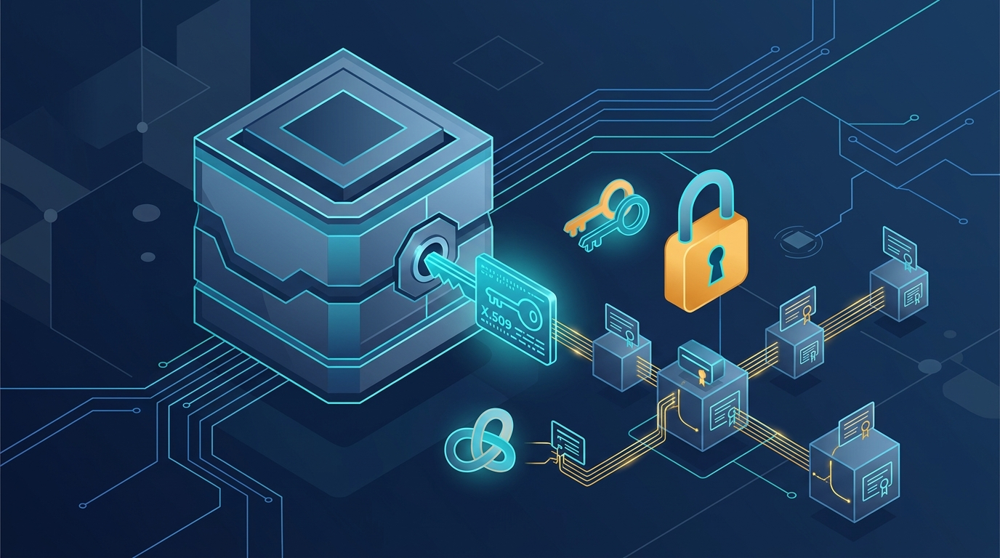

Otra pieza de Kubernetes v1.37 que se gradúa y esta vez es grande: **Pod Certificates** (junto a los **Cluster Trust Bundles**) llegó a **GA**, y trae emisión de certificados X.509 para TLS/mTLS directo al core de Kubernetes. Básicamente, una alternativa real a los service account JWTs para la identidad de producción de tus workloads.

## El problema con los bearer tokens

Hasta ahora, la identidad "de fábrica" en Kubernetes eran los **service account JWTs**. Son súper cómodos: el kubelet los escribe al filesystem del contenedor antes de que arranque, los mantiene actualizados, respetan least-privilege y se pueden federar para autenticarse con sistemas fuera del cluster (todo el pod-to-cloud auth de los grandes proveedores se apoya en esto). 

Pero tienen una falla de fondo: son **bearer tokens**. Quien tiene el token, *es* esa identidad. Y como obligatoriamente le pasas copias del JWT a todos tus peers para autenticarte, cualquiera de ellos podría hacerse pasar por ti. Existen mitigaciones parciales (time-, object- y audience-binding), pero ninguna es una defensa completa.

## La respuesta: proof-of-possession con X.509

La solución clásica son las credenciales **proof-of-possession**: no mandas tu credencial completa, sino una prueba de que la posees. Y eso casi siempre se construye sobre criptografía asimétrica (RSA, ECDSA). El estándar más maduro y desplegado: **certificados X.509**, como los de TLS.

Con Pod Certificates tu credencial se parte en dos:

- **Una llave privada**, que idealmente se genera dentro del workload (o en un HSM) y nunca sale de ahí.
- **Un certificado**, que describe tu identidad y tu llave pública, firmado por una Certificate Authority.

El objetivo declarado de la feature: que usar X.509 desde tu workload sea **tan fácil como usar un service account JWT**, pero manteniendo la barra de seguridad de Kubernetes.

## La arquitectura

Cuando usas Pod Certificates y Cluster Trust Bundles, entran tres componentes:

- **Tu aplicación**: pide certificados en el pod spec y lee llaves, certificados y trust bundles desde el filesystem del contenedor para hacer (m)TLS.
- **El kubelet**: emite objetos `PodCertificateRequest` y lee `ClusterTrustBundle` a nombre de tu workload.
- **El signer controller**: responde los `PodCertificateRequest` y publica los `ClusterTrustBundle`.

El diseño es parecido al de los service account JWTs, pero con una diferencia clave: **es pluggable**. El ecosistema X.509 es mucho más variado que el de JWT, así que el kubelet trae la maquinaria común, pero deja una interfaz para que convivan varios tipos de certificados en un mismo cluster al mismo tiempo.

A futuro se esperan al menos dos proveedores built-in: uno para **certificados TLS de servidor** (para los DNS names de los servicios) y otro para **certificados de cliente SPIFFE**, que llenaría el mismo rol que cumplen hoy los service account JWTs.

## Por qué importa

Porque mTLS con X.509 deja de ser un "proyecto aparte" que armas con sidecars, cert-manager y un montón de pegamento. Con esto, la identidad de producción se vuelve una capacidad nativa del cluster, con rotación automática y una barra de seguridad alta desde el día uno. Si ya operas workloads que hablan mTLS entre sí —o que necesitan autenticarse con sistemas externos sin regalar un bearer token— esto es exactamente la pieza que estabas esperando.

Ojo: es una fundación que acaba de llegar a GA. Los signers built-in (TLS de servidor y SPIFFE) todavía no están listos, así que por ahora la jugada es entender la arquitectura y mirar los signers controllers de la comunidad.

**Fuente:** anuncio oficial en kubernetes.io/blog (28-08-2026).
