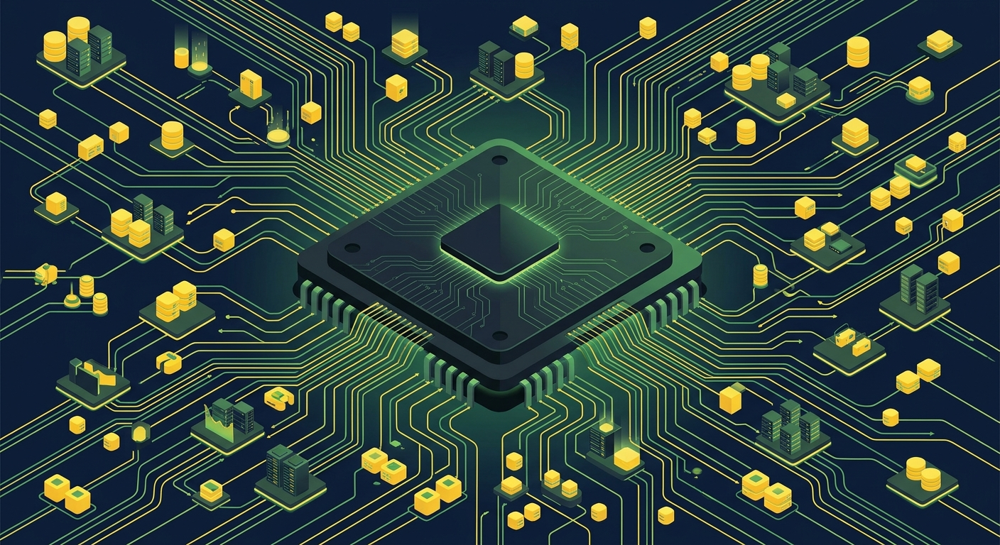

La noticia grande de la semana en IA infrastructure: Nvidia acordó pagar **US$12.900 millones por Hugging Face**, según reveló The Information. El paralelo que están haciendo todos los analistas es el correcto: es **Microsoft comprando GitHub en 2018**, pero con pesos en vez de código.

## La aritmética de la jugada

Hugging Face factura unos **US$150 millones anuales**. Nvidia reportó **US$96.200 millones solo el último trimestre**. Es decir, Nvidia pagó el equivalente a **12 días de ventas** por una empresa que apenas genera ingresos relativos. ¿Por qué? Porque Hugging Face no es un negocio de suscripciones: es **el lugar por defecto donde aterriza cada modelo abierto, cada fine-tune, cada dataset y cada leaderboard**, además de dueño de la librería `transformers` que usa media industria.

## La tesis defensiva

Los mayores clientes de Nvidia están construyendo rutas de escape: OpenAI diseña chips con Broadcom, Anthropic entrena en Trainium de Amazon, Google lleva una década con sus TPUs. El contrapeso de Nvidia son los **modelos abiertos**, porque corren en CUDA por defecto: descargas Qwen, lo fine-tuneas y lo sirves, y cada paso del pipeline te deja más adentro del stack de software de Nvidia. Como resumió el analista Aakash Gupta: "Nvidia gastó 12 días de ingresos para asegurarse de que el rival open source de sus propios clientes nunca muera".

La ironía es deliciosa: la maniobra con que los desarrolladores creían escapar de un vendor (usar modelos abiertos) los dejó más cómodos dentro de otro.

## El contexto que lo hace posible

La compra no cae de parachutas, aterriza sobre una semana donde el open weight pegó varios golpes:

- **Ollama 0.33.0** (21-08) permite correr Qwen, DeepSeek y Kimi **dentro de Claude Desktop** vía un proxy local que burla el bloqueo de IDs de modelo no-Anthropic. Abres el app, cambias el modelo, listo.
- Apple lanzó configuraciones nuevas de Mac Mini y Mac Studio que parecen hechas a medida para modelos grandes: Qwen3.8-27B en 4-bit ocupa 16,1GB y corre en un Mac de 32GB.
- La presión de precios sobre Anthropic y OpenAI sube: open source cubre ~90% de los use cases de startups, y los CFOs empiezan a apretar cuando la cuenta pasa de cinco cifras.

## El problema

La otra cara, y de la que la comunidad ya está hablando: Hugging Face era el **hub neutral** del ecosistema open source. Ahora su dueño tiene un interés comercial directo en que los modelos abiertos sigan atados a su hardware. Nadie espera que Nvidia cierre el acceso, pero la neutralidad del leaderboard, los datasets y Spaces queda, como mínimo, bajo observación. Bill Gurley lo resumió: los modelos abiertos son el desenlace inevitable, y Nvidia acaba de comprar la puerta de entrada.

Para los equipos de infraestructura: nada cambia mañana, pero si tu estrategia de modelos depende de Hugging Face (y probablemente depende), ahora tienes un proveedor más arriba en la cadena del que preocuparte.

Fuentes: [The Information](https://www.theinformation.com/) vía [The New Stack](https://thenewstack.io/nvidia-open-models-chips/) y [análisis de neutralidad](https://thenewstack.io/nvidia-hugging-face-acquisition-neutrality/) (27-28-08-2026).
