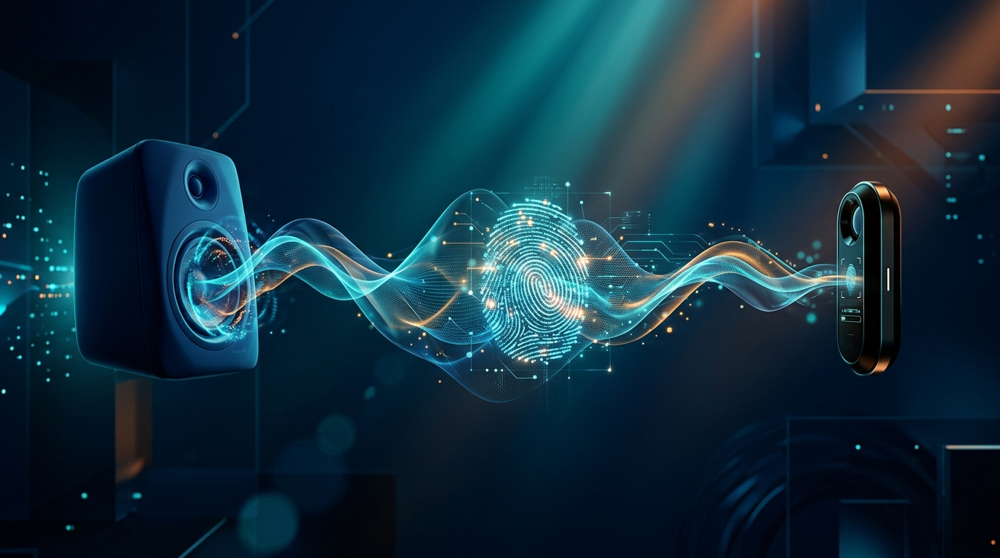

Todo partió por un problema de audífonos. Un developer estaba peleando con sus **audífonos Bluetooth multipoint** que no soltaban el audio del PC para pasárselo al teléfono, y en la búsqueda del culpable se topó con algo mucho más grande: **AliExpress estaba ejecutando rutinas de fingerprinting de audio silencioso** en su homepage.

## El descubrimiento

Matt Callaghan documentó que la tienda de Alibaba mantenía un **stream de audio activo sin reproducir ningún sonido perceptible**. Al deobfuscar los assets de la página, encontró las rutinas de tracking escondidas dentro de **AWSC**, el suite anti-bot de Alibaba. Los scripts `collina.js` y `fireyejs.js` construyen un grafo de procesamiento Web Audio diseñado para capturar artefactos de ejecución dependientes del hardware.

## Cómo funciona el fingerprinting de audio

La técnica es ingeniosa (y turbia). Se alimenta una forma de onda conocida a través de nodos de transformación matemática. Como el procesamiento de señales digitales se evalúa sobre distintas **unidades de punto flotante (FPU)**, sets de instrucciones (**AVX, ARM NEON**), motores de mezcla del sistema operativo y drivers de cada vendor, el resultado en el dominio de frecuencia presenta **variaciones numéricas mínimas pero únicas** para el stack de hardware y software de cada usuario.

En resumen: **tu CPU, tu GPU, tu OS y tus drivers** generan una "huella" de audio que te identifica, aunque no escuches nada.

El código que encontraron conectaba un oscilador de 10 kHz a un compresor, un analizador y un **GainNode con ganancia en cero**... pero conectado directo al `ctx.destination`:

```
osc.frequency.setValueAtTime(10000, ctx.currentTime);
gain.gain.value = 0.0;
osc.connect(compressor); compressor.connect(analyser);
compressor.connect(gain); gain.connect(ctx.destination);
```

Ese `gain = 0` conectado al destino inicializa un **stream de audio "unmuted" a nivel de plataforma** — el que le arruinaba la vida a los audífonos multipoint al impedir que el OS entrara en idle y bloquear el routing Bluetooth.

## El debate de fondo

El caso revive la discusión sobre el **modelo de seguridad de la Web Audio API**. **Brave** respondió públicamente al incidente, contrastando su modelo defensivo: navegadores centrados en privacidad ya aplican contramedidas, pero el incidente deja en evidencia el hueco que hay en los estándares web respecto a la **inicialización del audio context y la privacidad del usuario**.

Es un recordatorio incómodo: el fingerprinting no necesita cookies ni permisos. Basta con una pestaña abierta y tu propio hardware como identificador.
