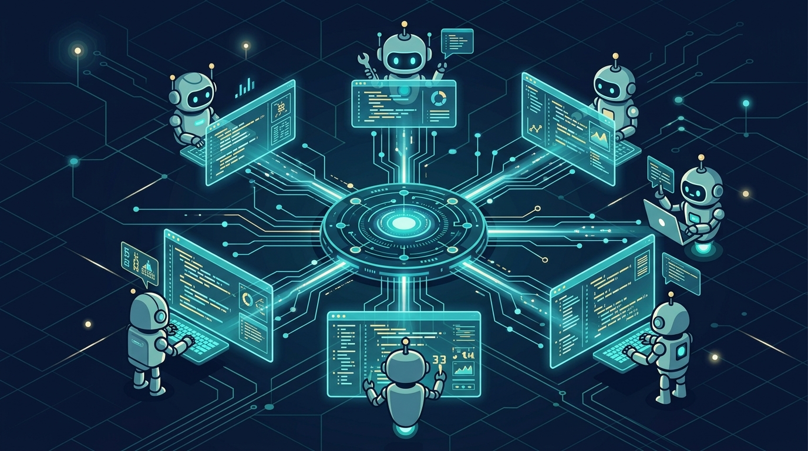

Amazon acaba de abrir el código de **Kiro Crew**, un sistema para correr varios agentes de código (los Kiro) de forma simultánea y **asíncrona**: lanzas una tarea, te vas a hacer otra cosa, y vuelves a algo que vale la pena revisar. Nada de andar babysitteando un prompt a la vez.

La gracia no es el "qué", sino el "quién lo usa". Nacido internamente como **MeshClaw**, ya lo adoptaron **más de 39.000 desarrolladores dentro de Amazon** — y 500 contribuidores en seis meses, sin que nadie se los ordenara. Ese dato le importó más a la comunidad que la lista de features.

## Cómo funciona

Kiro Crew orquesta agentes a través del **Agent Client Protocol (ACP)**, el mismo estándar que usa Zed, y te da visibilidad en vivo de lo que hace cada agente: su plan, sus llamadas a herramientas, sus gates de aprobación y sus resultados.

Los casos de uso que la propia gente de Amazon menciona son bien de operación real:

- Investigación de incidentes
- Triage de tickets (y de Dependabot, que nadie quiere hacer a mano)
- Migraciones (CI/CD incluido)
- Monitoreo de pull requests
- Tareas agendadas y trabajo de larga duración

Todo esto corre en sesiones persistentes y multi-sesión: los agentes mantienen contexto del proyecto, delegan trabajo a subagentes y se integran con herramientas externas vía **MCP y webhooks**. Soporta además las "skills" de otras plataformas abiertas de agentes sin modificación.

## Seguridad de verdad, no de marketing

Esto es lo que más ruido hizo en el subreddit de Kiro: el enfoque de seguridad. Kiro Crew viene con *defense in depth* desde el día uno:

- Sandbox a nivel de OS
- Comandos *denied by default*
- Bloqueo de patrones sospechosos
- Validación de inputs y bloqueo de rutas sensibles
- Redacción de credenciales
- Audit log firmado de cada acción

La frase de los autores (Bolin Chen, Zejiang Guo y Zezhen Xu) resume la motivación: "queríamos algo simple que no existía internamente, inspirados por el momentum de OpenClaw y las herramientas de agentes con auto-aprendizaje, pero que cumpliera nuestros requisitos de seguridad para desarrollo interno".

## El pero

No todo es aplausos. Varios devs en Reddit advierten que **Kiro Crew consume tokens bastante más rápido que el CLI de Kiro**, así que ojo con la cuenta si lo dejas corriendo de noche con un modelo caro.

Lo importante del fondo: esto es otra señal de que la infraestructura de agentes ya no es "un agente que codea", sino **flotas de agentes que trabajan en paralelo mientras duermes**. Y AWS acaba de poner la suya sobre la mesa.
