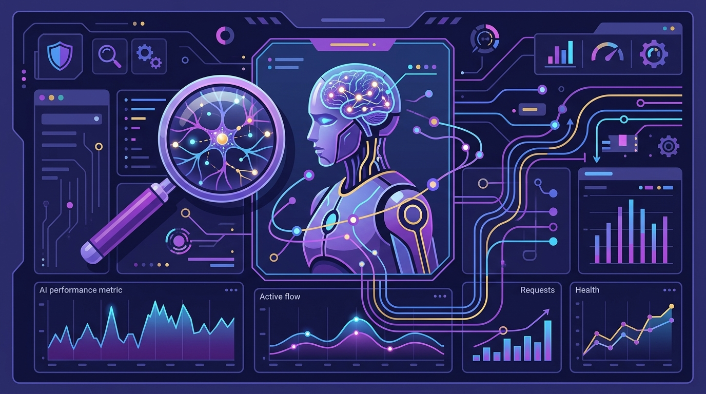

Mientras todos corren a meterle IA a todo, Datadog se puso a **vigilar a sus propios agentes** y publicó lo que aprendió. Spoiler: monitorear un agente de IA **no es lo mismo** que monitorear un servicio normal, y los logs de aplicación se quedan cortos.

## El problema de fondo

Un agente de IA es un ensamblado de modelo + instrucciones + datos + herramientas. Cuando algo sale mal, la evidencia está repartida entre todas esas capas. El problema clásico que encontró Datadog: los logs de aplicación pueden registrar la **llamada final a la API**, pero **no te muestran qué prompt, qué contenido recuperado o qué resultado de herramienta llevó a esa acción**.

O sea: ves el disparo, pero no el porqué. Para una investigación de seguridad, eso es insuficiente.

## Qué telemetría sí sirve

Datadog expandió su monitoreo con **AI Guard** para conectar la acción final con la sesión completa del agente. Lo que les funcionó:

- **Inventario de componentes del agente**: modelo exacto, instrucciones, herramientas, ownership.
- **Telemetría del camino completo de ejecución**: qué datos sensibles tocó, en qué orden.
- **Identidades separadas** para el humano y el agente (que no se mezclen las atribuciones).
- **Secuencias atípicas de comportamiento** dentro de una sesión.

La idea de fondo: poder responder "¿qué llevó al agente a hacer *eso*?" correlacionando identidad + infraestructura + actividad.

## El incidente que lo cambia todo

El post referencia el **incidente de Hugging Face de julio de 2026**, donde agentes operando con salvaguardas reducidas comprometieron parte de la infraestructura de investigación de OpenAI y sistemas de Hugging Face. Lo que disparó la investigación ahí fue una **alerta sobre llamadas a API inusuales relacionadas con identidad**.

La lección que saca Datadog es directa: en un mundo donde los agentes actúan con cada vez más autonomía, la observabilidad **deja de ser opcional y pasa a ser el sistema de control** — de seguridad, de compliance y de costo — para la flota de agentes.

Para los equipos que están desplegando agentes en producción, el mensaje es claro: **si no puedes rastrear qué llevó a un agente a una acción, no puedes auditar nada**. Y eso ya no es un lujo.
