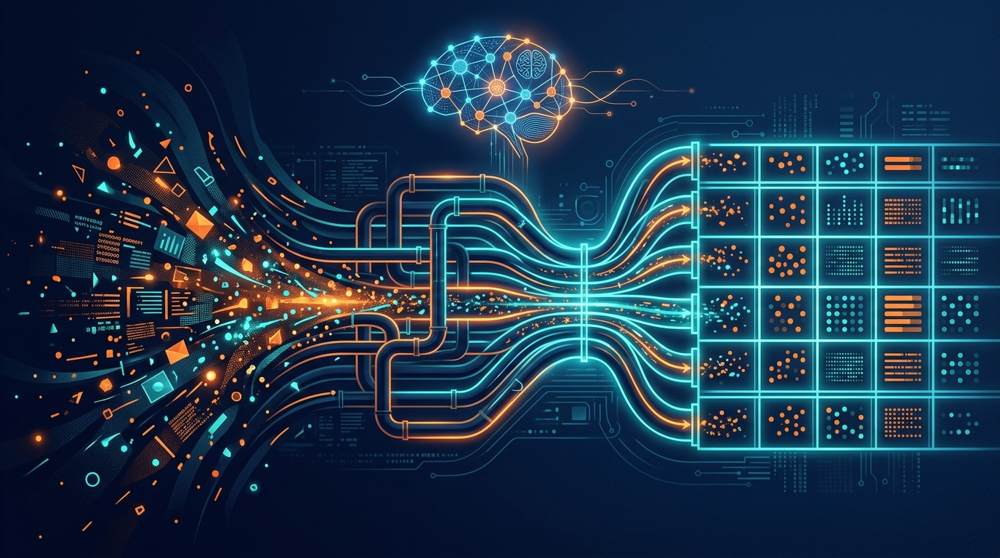

Splunk acaba de ponerle IA a una de las partes más fomes (y más críticas) de la observabilidad: **hacer que el machine data llegue bien, estructurado y confiable**. La novedad se llama **AI-Powered Data Management**, corre sobre **Cisco Data Fabric powered by Splunk Platform**, y trae dos capacidades que pasan a disponibilidad general (GA) más una que queda en acceso controlado.

La tesis es simple y duele de verdad: "meter datos a Splunk es fácil, **usarlos** es lo difícil". Cada fuente nueva —apps, servicios cloud, tools de seguridad, red, endpoints— trae sus propios formatos, campos faltantes y mapeos inconsistentes. Y cuando el CIM (Common Information Model) se desalinea, la detección de seguridad empieza a arrojar resultados incompletos sin que nadie se dé cuenta.

## Qué se libera

**Guided Onboarding con Auto-schema (GA).** Un flujo con dos patas para sacar al admin del "¿por dónde empiezo?":
- *Plan data onboarding*: hace preguntas, recomienda una estrategia y arma una lista de tareas enfocada.
- *Schematize custom data*: toma eventos de muestra, identifica patrones, recomienda mapeos y genera la lógica de extracción de campos (hasta paquetes add-on o templates SPL2).

**Self-Healing Pipelines (GA, con Splunk Ingest Monitoring 1.4.0).** El plato fuerte. Monitorea el cumplimiento CIM, detecta drift, y con IA analiza la causa raíz y propone fixes. El flujo es de cuatro pasos: *detectar* degradación → *analizar* causa con IA → *revisar* cambios en un diff lado a lado (props.conf / transforms.conf) → *deployar* vía un add-on overlay que no toca los archivos originales. La clave es que **el admin sigue al mando**: la IA propone, el humano revisa.

**Automated Field Extraction (Controlled Availability).** Para reducir la tarea regex de extraer campos en ingest, usando IA para sugerir los campos a extraer.

## Por qué importa

Esto no es cosmética. Es el argumento de **"AI readiness"** de Splunk: los agentes y workflows agentic necesitan datos gobernados, discoverables y precisos — no telemetría cruda. Si tu data foundation es un desastre, la IA que corre encima hereda el desastre.

El pitch de fondo: menos toil manual, datos de mejor calidad, y una base operacional lista para la era agéntica. Y con la vara de que en Splunk ya llevan varias semanas empujando esta línea —Agent Launchpad, medir costo por resultado, Call Graph Profiling— queda claro que el mensaje 2026 es "**observabilidad que se opera sola, con el humano revisando**".

¿Me quedo con una duda? Sí: hasta dónde llega el "self-healing" de verdad. Por ahora las remediaciones son *propuestas* que el admin aprueba. Autónomo sí, autónomo pero con freno de mano.
