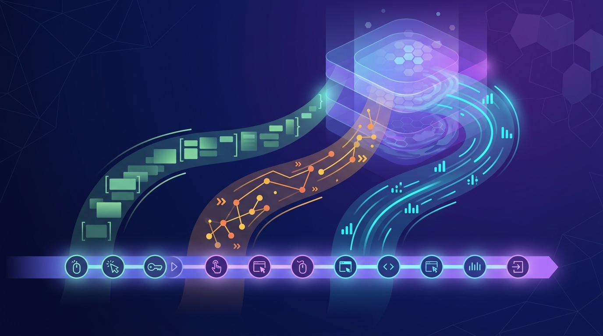

Cuando un checkout falla o una transacción queda en disputa, las métricas y los eventos no bastan: hay que **ver lo que vio el usuario**. Ese es el argumento de Dynatrace con su nuevo **Session Replay**, que acaba de salir a disponibilidad general para todos los clientes SaaS que usan Grail.

La gracia no es el replay en sí —eso ya existía—, sino que ahora las grabaciones viven **dentro del data lakehouse unificado Grail**. Cada sesión queda conectada con logs, trazas, eventos y datos de Real User Monitoring (RUM), sin tener que saltar entre herramientas ni hacer stitching manual. Eso permite encontrar exactamente la sesión que buscas y luego reproducirla como capa visual.

### Cómo funciona

Mientras revisas una sesión, el lado izquierdo muestra la línea de tiempo cronológica con eventos y acciones agrupadas. El playhead recorre esa línea de tiempo y te deja saltar directo al punto de interés, con controles de velocidad, salto de inactividad y retroceso de unos segundos.

Hay un overlay visual que marca los eventos clave —incluidos los nuevos **User Interactions**— para que identifiques rápido los momentos críticos sin tener que escarbar minutos de grabación. Y **Dynatrace Assist** acompaña resumiendo sesiones y posibles root causes.

### El "por qué" del dato único

Para equipos de observabilidad que ya viven en Dynatrace, esto cierra un hueco molesto: antes había que correlacionar el frontend con el backend a mano. Ahora un error de tarjeta de crédito en el código aparece directamente enlazado con su sesión, su traza y su log, todo en un solo lugar.

En un mercado donde la "experiencia digital" se mide por milisegundos, tener el replay atado al resto de la telemetría es un salto concreto: menos adivinanza, menos tiempo de resolución.
