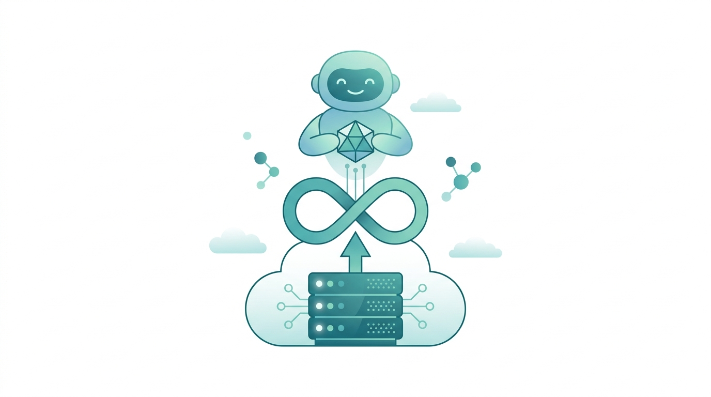

Google Cloud sumó una pieza pensada justo para el boom de los agentes: **Cloud Run instances**, un runtime de cómputo singleton para cargas de larga duración y con estado. La tesis es simple: los agentes de IA personales no se comportan como un servicio web stateless.

Un agente como **OpenClaw** o **Hermes** trabaja de forma continua y suele atender a un solo usuario a la vez. Cloud Run services escala a cero cuando no hay requests, así que no calza. La alternativa —un VM dedicado— implica pagar cómputo 24/7, parchar el SO, abrir puertos y montar tus propios endpoints HTTPS.

### Qué ofrece

Cloud Run instances entrega lo mejor de ambos mundos:

- **Una sola instancia, sin autoscaling.**
- Hasta **7 días de ejecución continua**, con política de reinicio automático.
- Una **URL HTTPS estable** que no cambia entre actualizaciones y reinicios.
- Posibilidad de **detener y reanudar** la instancia cuando no la uses.

El dato que más llama la atención es el precio: una instancia con **1 vCPU y 1 GiB de RAM corriendo 30 días continuos cuesta US$5,70**. Usa vCPU compartida con presupuesto de burst, ideal para agentes que no hacen cómputo intensivo todo el tiempo y solo pican cuando se les pide una tarea.

### El caso OpenClaw

Google usa OpenClaw como ejemplo oficial: subes la config a un bucket de Cloud Storage y despliegas el agente con un solo comando, para interactuar por Telegram, WhatsApp o la red que quieras. Incluso hay un codelab dedicado.

Además, anunciaron que **pronto llegará acceso SSH** tanto a instancias como a servicios de Cloud Run. Con esto, la línea entre serverless y VM se difumina todavía más para el caso de uso de agentes personales.
