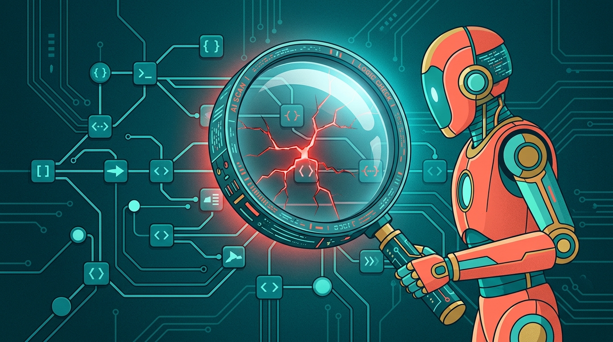

**Sonar** sacó un agente de IA nuevo: el **SonarQube Hunter Agent**, pensado para encontrar las vulnerabilidades que los scanners tradicionales simplemente no ven.

## Qué caza exactamente

El agente analiza el codebase completo buscando tres categorías de fallas que históricamente requerían testing manual o un pentest:

1. **Broken access control**
2. **Vulnerabilidades de lógica de negocio**
3. **Problemas de autenticación y manejo de sesiones**

La clave está en el enfoque: en vez de buscar patrones "que se ven mal" en el código, **traza cómo se mueven el código y los datos a través de la aplicación**. Una escalada de privilegios, por ejemplo, solo se hace visible cuando entiendes cómo se *supone* que debe funcionar el código.

## El hueco que viene a tapar

Satinder Khasriya (product marketing de Sonar) lo explica bien: los **scanners determinísticos** son buenos para pillar inyecciones, data flows inseguros y patrones inseguros. Pero hay vulnerabilidades que **no son detectables mirando solo el código** — dependen de la intención y el flujo de negocio.

El Hunter Agent corre estas investigaciones **on demand**, identifica al developer que creó cada pedazo de código, y sube los issues verificados directo a tu workflow de DevSecOps vía integraciones con CI/CD.

## Por qué importa ahora

El argumento de fondo es de tiempo. Con la IA permitiendo a los cibercriminales descubrir y explotar vulnerabilidades en cuestión de **horas**, el tiempo entre una vulnerabilidad y su explotación se achicó dramáticamente. Si DevSecOps sigue esperando los ciclos de escaneo legacy, llega tarde.

Y hay una verdad incómoda ahí: **cada línea de código ya es superficie de ataque**, y el ritmo al que se crea ese código (con IA de por medio) está desbordando los workflows actuales. Por un lado hay que eliminar vulnerabilidades en código nuevo; por otro, pagar una deuda técnica acumulada por décadas. Con exploits que a veces se desarrollan **más rápido que el parche** que los corrige.

La señal es consistente con lo que venimos viendo todo el mes: la seguridad se está moviendo de "detectar patrones" a "razonar sobre el flujo", y los agentes IA están entrando a ambos lados del mostrador.

---

**Fuente:** [DevOps.com — Sonar AI Agent Discovers Vulnerabilities Hidden in Business Logic Workflows](https://devops.com/sonar-ai-agent-discovers-vulnerabilities-hidden-in-business-logic-workflows/) · [Sonar](https://www.sonarsource.com/company/press-releases/sonar-launches-sonarqube-hunter-agent/)
