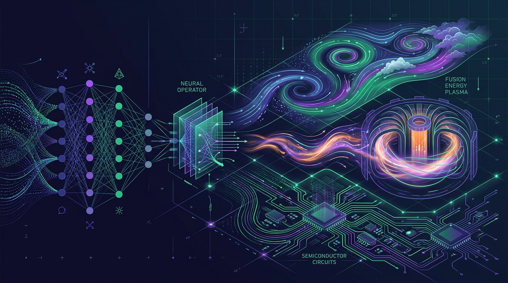

Mientras la mayoría de los titulares de IA giran en torno a chatbots y agentes, **Anima Anandkumar** —profesora de Caltech y ex directiva de NVIDIA— acaba de lanzar **Accelerated Understanding**, una empresa enfocada en algo bastante más ambicioso: usar IA para **simular y entender el mundo físico**.

La idea central es que los Transformers, que dominan el lenguaje, no son la herramienta ideal para modelar procesos físicos continuos. Por eso Anandkumar y su cofundador Benedikt Jenik apostaron por **operadores neuronales** (neural operators), una arquitectura que aprenden a mapear funciones en vez de secuencias de tokens. En pruebas, el sistema habría ingerido **5 billones de puntos de datos en un solo prompt** —órdenes de magnitud por encima de lo que manejan los flagship de Anthropic o Google.

### Dónde aplica

Esto no es investigación de laboratorio aislada. Las aplicaciones son de las que mueven la aguja de verdad:

- **Pronóstico del clima** y simulación atmosférica.
- **Fusión nuclear** y diseño de reactores.
- **Semiconductores:** optimización del proceso de fabricación de chips.
- **Dispositivos médicos** y componentes de computación cuántica.

El timing es simbólico: el lanzamiento llegó justo cuando Anandkumar fue incluida en la lista **TIME100 AI 2026**, un reconocimiento a una trayectoria que lleva una década cruzando IA con ciencia.

### Por qué importa

Para el mundo de infraestructura y arquitectura, esto abre una pregunta interesante: si la IA de simulación física despega, cambia el tipo de cómputo que las empresas van a necesitar —más HPC, más GPU de precisión mixta, menos inferencia de texto—. Es el recordatorio de que "IA" es un paraguas enorme, y que el próximo gran salto podría no venir de un LLM más grande, sino de una arquitectura completamente distinta.
