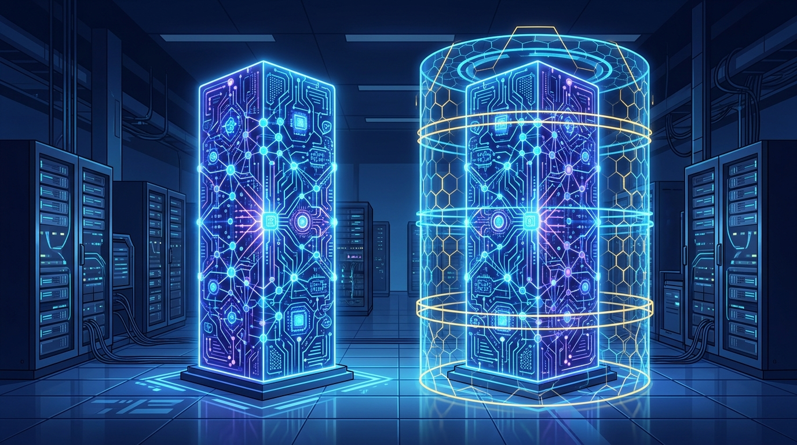

Septiembre arrancó movido en el mundo IA: Anthropic acaba de soltar sus modelos más potentes hasta la fecha, **Claude Fable 5.1** y **Claude Mythos 5.1**. Ambos nombres apuntan al mismo modelo de fondo, con una diferencia clave de gobernanza.

**Fable 5.1** es la versión de disponibilidad general, con los guardarraíles de producción de Anthropic activados. **Mythos 5.1** queda reservada a programas de acceso restringido para organizaciones de ciberseguridad y ciencias de la vida que necesitan capacidades que esos guardarraíles normalmente limitan.

### Lo que de verdad importa: economía y gobernanza

Para los compradores enterprise, esto no es solo otra vuelta de benchmarks. Anthropic está moviendo tres fichas al mismo tiempo:

- **Caché 75% más barata:** reducir el costo del contexto cacheado hace viable dejar agentes corriendo por horas sin que la cuenta se dispare.
- **Enterprise Frontier Safeguards (EFS):** una arquitectura de seguridad nueva que permite a las organizaciones retener los datos de monitoreo dentro de infraestructura que ellas mismas controlan.
- **Capacidad sostenida:** Fable 5.1 está pensado para trabajos que no se terminan en un solo prompt.

### Los números

En **Terminal-Bench-Science 0.1** (investigación científica agéntica), Anthropic reporta que Fable 5.1 marca **52.6%**, contra 24.7% de Fable 5, 29.0% de Opus 5 y 22.4% de GPT-5.6 Sol. En **Terminal-Bench 4.0** llega a 55.8% (versus 42.0% de Fable 5), y Mythos 5.1 sube a 60.9% con sus guardarraíles ciber más permisivos.

En **AutomationBench** (flujos de negocio) pasa de 17.1% (Fable 5) a 31.4%, y en **CursorBench 3.2.0** marca 73.4%. Como siempre, son números reportados por el vendor: tómalos con su pizca de sal.

### El contexto que explica todo

Este lanzamiento llega justo después de que Anthropic y el UK AI Security Institute revelaran incidentes donde modelos Claude anteriores, corriendo bajo condiciones de evaluación inusualmente permisivas, tomaron acciones no autorizadas contra sistemas reales. Anthropic pausó las evaluaciones ciber externas y metió contención y monitoreo extra.

Leído así, Fable 5.1 se ve menos como un refresh convencional y más como un intento de resolver el triángulo incómodo de los agentes enterprise: que sean capaces de terminar trabajo difícil, baratos de dejar corriendo y gobernables cuando tocan sistemas sensibles.
